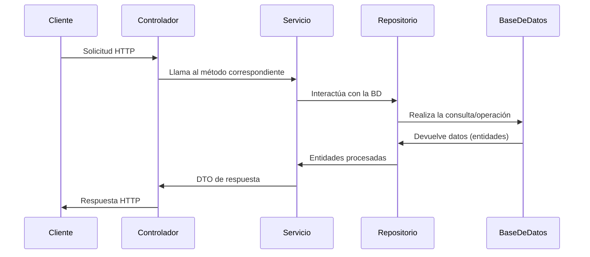
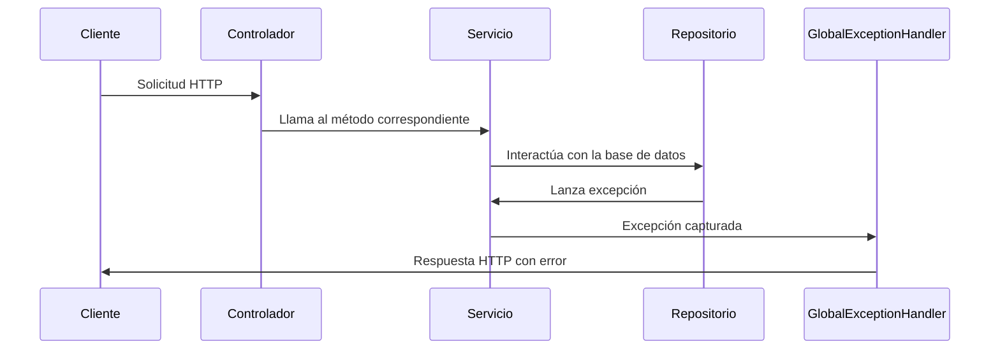

### **Flujo Completo de una Solicitud en la Aplicación**

En una aplicación típica con **Spring Boot** y capas organizadas en **Controlador**, **Servicio** y **Repositorio**, el flujo desde que llega una solicitud hasta que se devuelve una respuesta sigue un patrón bien definido. Este es el desglose:

---

### **1. Entrada: Solicitud del Cliente**

El cliente (navegador, frontend como React, Postman, Insomnia, etc.) envía una solicitud HTTP a la aplicación.

- **Ejemplo de solicitud:**
  ```http
  POST /libros
  Content-Type: application/json
  Authorization: Bearer <jwt_token>

  {
      "titulo": "Cien años de soledad",
      "autorId": 1,
      "genero": "Novela",
      "anyoPublicacion": "1967"
  }
  ```

#### **Puntos Clave:**
- La solicitud contiene encabezados (e.g., `Authorization`) y un cuerpo JSON.
- El token JWT en el encabezado de autorización se utiliza para verificar que el cliente está autenticado.

---

### **2. Controlador: Punto de Entrada**

El **controlador** recibe la solicitud. Aquí se:
1. **Valida la solicitud:**
   - Verifica que los datos requeridos están presentes (e.g., usando `@Valid` en los DTO).
   - Extrae datos del token JWT, si es necesario.
2. **Llama al servicio apropiado:**
   - Pasa los datos recibidos al servicio.

#### **Ejemplo:**
```java
@PostMapping
public ResponseEntity<LibroResponseDTO> crearLibro(@RequestBody @Valid CrearLibroDTO crearLibroDTO) {
    LibroResponseDTO nuevoLibro = libroService.crearLibro(crearLibroDTO);
    return ResponseEntity.status(HttpStatus.CREATED).body(nuevoLibro);
}
```

---

### **3. Servicio: Lógica de Negocio**

El **servicio** es responsable de:
1. Implementar la lógica de negocio:
   - Validar reglas específicas del dominio.
   - Transformar los DTOs recibidos en entidades, si es necesario.
2. Interactuar con el repositorio para acceder o modificar la base de datos.

#### **Ejemplo:**
```java
@Transactional
public LibroResponseDTO crearLibro(CrearLibroDTO crearLibroDTO) {
    Autor autor = autorRepository.findById(crearLibroDTO.getAutorId())
            .orElseThrow(() -> new RecursoNoEncontradoException("Autor no encontrado con id " + crearLibroDTO.getAutorId()));

    Libro libro = new Libro();
    libro.setTitulo(crearLibroDTO.getTitulo());
    libro.setGenero(crearLibroDTO.getGenero());
    libro.setAnyoPublicacion(crearLibroDTO.getAnyoPublicacion());
    libro.setEstado("disponible");
    libro.setAutor(autor);

    libro = libroRepository.save(libro);

    return new LibroResponseDTO(libro);
}
```

---

### **4. Repositorio: Acceso a la Base de Datos**

El **repositorio** interactúa directamente con la base de datos para realizar operaciones CRUD (Create, Read, Update, Delete).

#### **Ejemplo:**
```java
@Repository
public interface LibroRepository extends JpaRepository<Libro, Long> {
    List<Libro> findByGenero(String genero);
}
```

En este caso, el repositorio:
1. Guarda el nuevo libro (`save`).
2. Recupera datos relacionados (e.g., busca un autor por su ID).

---

### **5. Respuesta al Cliente**

Después de que el servicio realice todas las operaciones necesarias:
1. Convierte las entidades en DTOs de respuesta, si es necesario.
2. Devuelve los datos al controlador, que empaqueta la respuesta y la envía al cliente.

#### **Ejemplo de Respuesta:**
```http
HTTP/1.1 201 Created
Content-Type: application/json

{
    "id": 101,
    "titulo": "Cien años de soledad",
    "autor": "Gabriel García Márquez",
    "genero": "Novela",
    "anyoPublicacion": "1967",
    "estado": "disponible"
}
```

---

### **Flujo de Respuesta**

#### **1. Repositorio → Servicio**
El repositorio devuelve datos desde la base de datos al servicio.

- Los datos suelen estar en forma de **entidades**.

#### **2. Servicio → Controlador**
El servicio transforma los datos en un formato adecuado para la respuesta al cliente:

- Transforma **entidades** en **DTOs de respuesta**.
- Aplica lógica adicional para ajustar el formato.

#### **3. Controlador → Cliente**
El controlador devuelve la respuesta al cliente en un formato HTTP válido:

- Define el código de estado (e.g., `201 Created`, `200 OK`).
- Empaqueta el DTO o cualquier dato adicional como cuerpo de la respuesta.

---

### **Esquema Completo del Flujo**



---

### **Puntos Clave para Entender el Flujo**

1. **Seguridad:**
   - El filtro de JWT (`JwtRequestFilter`) asegura que el token sea válido antes de que la solicitud llegue al controlador.
   - Los roles del usuario son evaluados para restringir el acceso según las reglas.

2. **Validación:**
   - Los DTOs validados en el controlador aseguran que los datos sean correctos antes de procesarlos.

3. **Transformación:**
   - Los servicios transforman entidades en DTOs para asegurar que el cliente reciba datos bien estructurados y protegidos.

4. **Respuestas Uniformes:**
   - El uso de DTOs garantiza que la respuesta sea consistente y no exponga detalles internos de la base de datos.

Este enfoque asegura un flujo limpio y escalable en aplicaciones Spring Boot. 🚀


Cuando se utiliza un **`@ControllerAdvice`** con **`@ExceptionHandler`** en Spring Boot, la respuesta a un error **no pasa de vuelta por el controlador original**. En lugar de eso, la lógica definida en el **ControllerAdvice** intercepta la excepción y envía una respuesta directa al cliente.

### **Flujo de Manejo de Errores con `@ControllerAdvice`**

1. **Se lanza una excepción:**
   - Desde cualquier punto del flujo (controlador, servicio, o repositorio).
   - Ejemplo: `throw new RecursoNoEncontradoException("El recurso no existe");`

2. **Interceptación por `@ControllerAdvice`:**
   - Spring detecta la excepción y busca un método en el **ControllerAdvice** anotado con `@ExceptionHandler` para manejar esa excepción específica.

3. **Generación de la respuesta:**
   - El método del ControllerAdvice devuelve una respuesta HTTP (como un `ResponseEntity`) que contiene:
     - Código de estado apropiado (e.g., `404 Not Found`, `400 Bad Request`).
     - Un mensaje de error o un cuerpo JSON estructurado.

4. **Respuesta directa al cliente:**
   - Spring envía esta respuesta directamente al cliente.
   - **No pasa nuevamente por el controlador original.**

---

### **Ejemplo del Flujo de Error**

#### **1. Excepción lanzada en un servicio:**
```java
public Libro obtenerLibro(Long id) {
    return libroRepository.findById(id)
            .orElseThrow(() -> new RecursoNoEncontradoException("Libro no encontrado con id " + id));
}
```

#### **2. Interceptación por ControllerAdvice:**
```java
@ControllerAdvice
public class GlobalExceptionHandler {

    @ExceptionHandler(RecursoNoEncontradoException.class)
    public ResponseEntity<Map<String, String>> handleRecursoNoEncontradoException(RecursoNoEncontradoException ex) {
        Map<String, String> error = new HashMap<>();
        error.put("error", "Recurso no encontrado");
        error.put("mensaje", ex.getMessage());
        return ResponseEntity.status(HttpStatus.NOT_FOUND).body(error);
    }

    @ExceptionHandler(DataIntegrityViolationException.class)
    public ResponseEntity<Map<String, String>> handleDataIntegrityViolation(DataIntegrityViolationException ex) {
        Map<String, String> error = new HashMap<>();
        error.put("error", "Violación de integridad de datos");
        error.put("mensaje", "No se puede eliminar el recurso porque está relacionado con otros elementos.");
        return ResponseEntity.status(HttpStatus.CONFLICT).body(error);
    }
}
```

#### **3. Respuesta directa al cliente:**

Si se intenta acceder a un libro inexistente, el cliente recibe:

```http
HTTP/1.1 404 Not Found
Content-Type: application/json

{
    "error": "Recurso no encontrado",
    "mensaje": "Libro no encontrado con id 101"
}
```

#### Si ocurre una violación de integridad:
```http
HTTP/1.1 409 Conflict
Content-Type: application/json

{
    "error": "Violación de integridad de datos",
    "mensaje": "No se puede eliminar el recurso porque está relacionado con otros elementos."
}
```

---

### **Ventajas del Flujo de Manejo de Errores con `@ControllerAdvice`**

1. **Centralización del manejo de errores:**
   - Todas las excepciones se gestionan en un solo lugar.
   - Facilita el mantenimiento y la consistencia de las respuestas.

2. **Independencia del Controlador:**
   - El controlador no necesita preocuparse por manejar excepciones. Puede delegar esa responsabilidad al `@ControllerAdvice`.

3. **Respuestas uniformes:**
   - El cliente siempre recibe respuestas bien estructuradas, independientemente del controlador o servicio que genere la excepción.

4. **Mejor legibilidad del código:**
   - Los controladores y servicios no están sobrecargados con lógica de manejo de errores.

---

### **Flujo Completo del Manejo de Errores**



En resumen:
- **Errores normales:** Respuesta directa del ControllerAdvice.
- **Respuesta no pasa por el controlador original.**
