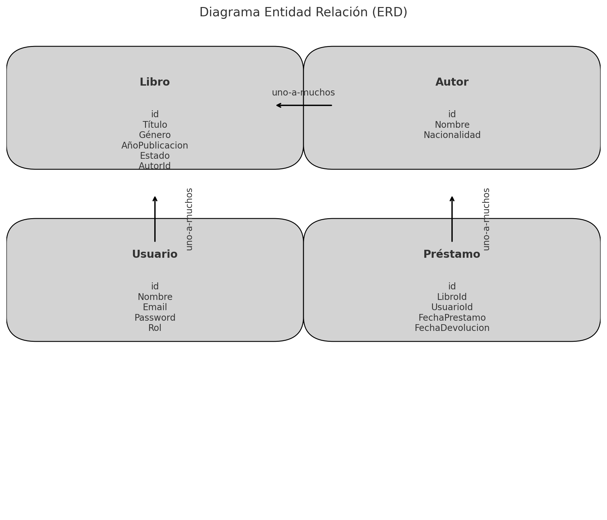

#+TITLE: Gestión de Biblioteca
#+AUTHOR:
#+EMAIL:
#+DATE:
#+OPTIONS: texht:t toc:3 num:3 -:nil ^:{} ":nil ':nil
#+OPTIONS: tex:t
#+LATEX_CLASS: article
#+LATEX_HEADER:
#+LANGUAGE: es

#+BEGIN_COMMENT
#+LATEX_HEADER: \usepackage[AUTO]{babel}
#+END_COMMENT

#+LATEX_HEADER: \renewcommand{\contentsname}{Tabla de contenidos}

#+LATEX_HEADER_EXTRA: \usepackage{mdframed}
#+LATEX_HEADER_EXTRA: \BeforeBeginEnvironment{minted}{\begin{mdframed}}
#+LATEX_HEADER_EXTRA: \AfterEndEnvironment{minted}{\end{mdframed}}

#+LATEX: \setlength\parindent{10pt}
#+LATEX_HEADER: \usepackage{parskip}

#+latex_header: \usepackage[utf8]{inputenc} %% For unicode chars
#+LATEX_HEADER: \usepackage{placeins}

#+LATEX_HEADER: \usepackage[margin=2.50cm]{geometry}

#+LaTeX_HEADER: \usepackage[T1]{fontenc}
#+LaTeX_HEADER: \usepackage{mathpazo}
#+LaTeX_HEADER: \linespread{1.05}
#+LaTeX_HEADER: \usepackage[scaled]{helvet}
#+LaTeX_HEADER: \usepackage{courier}

#+LaTeX_HEADER: \hypersetup{colorlinks=true,linkcolor=blue}
#+LATEX_HEADER: \RequirePackage{fancyvrb}
#+LATEX_HEADER: \DefineVerbatimEnvironment{verbatim}{Verbatim}{fontsize=\small,formatcom = {\color[rgb]{0.5,0,0}}}
* Vamos a desarrollar el proyecto paso a paso

** 1. Modelo Entidad/Relación
El modelo entidad/relación ya lo hemos desarrollado en pasos anteriores, así que lo damos por completado. Queda claro que vamos a trabajar con las siguientes entidades:

- **Autor**
- **Libro**
- **Usuario**
- **Préstamo**

Relaciones principales:
- **Un autor puede tener muchos libros**.
- **Un libro pertenece a un autor**.
- **Un usuario puede realizar muchos préstamos**.
- **Cada préstamo está relacionado con un solo libro y un solo usuario**.

#+CAPTION: Diagrama E/R generado.
#+ATTR_LATEX:width 300px

** 2. Crear el proyecto Spring Boot con Spring Initializr
Para crear el proyecto, vamos a utilizar **Spring Initializr**. Estos son los pasos:

*** 2.1. Configurar Spring Initializr
1. Ve a [[https://start.spring.io/][Spring Initializr]].
2. Configura el proyecto con los siguientes parámetros:
   - **Project**: Maven Project
   - **Language**: Java
   - **Spring Boot Version**: 3.0.0 (o la versión estable más reciente).
   - **Group**: `com.biblioteca`
   - **Artifact**: `gestion-biblioteca`
   - **Name**: `gestion-biblioteca`
   - **Description**: API REST para la gestión de una biblioteca.
   - **Package name**: `com.biblioteca.gestion`
   - **Packaging**: Jar
   - **Java Version**: 17 (si usas una versión más reciente de JDK).

*** 2.2. Dependencias a seleccionar
Selecciona las siguientes dependencias:
- **Spring Web**: Para desarrollar la API REST.
- **Spring Data JPA**: Para la persistencia con JPA.
- **H2 Database**: Base de datos en memoria para el desarrollo.
- **Spring Security**: Para la autenticación y autorización.
- **Spring Boot DevTools** (opcional): Para autorecarga durante el desarrollo.
- **Lombok**: Para reducir la cantidad de código repetitivo (como getters, setters y constructores).

Descarga el proyecto generado y descomprímelo si es necesario.

** 3. Abrir el proyecto en el IDE y configurar la base de datos H2

*** 3.1. Abrir el proyecto en IntelliJ IDEA o Eclipse
- Abre tu IDE preferido (IntelliJ o Eclipse).
- Importa el proyecto **Maven** que has descargado, elige la carpeta del proyecto y deja que el IDE configure las dependencias automáticamente.

*** 3.2. Configurar la base de datos H2
Vamos a usar **H2** como base de datos en memoria para el desarrollo inicial. La configuración básica de **H2** debe estar en el archivo `application.properties` o `application.yml`.

Aquí tienes cómo configurarlo en **`application.properties`**:

#+BEGIN_SRC properties
# Configuración H2
#spring.datasource.url=jdbc:h2:file:./data/biblioteca
spring.datasource.url=jdbc:h2:mem:biblioteca
spring.datasource.driverClassName=org.h2.Driver
spring.datasource.username=sa
spring.datasource.password=
spring.h2.console.enabled=true
spring.jpa.database-platform=org.hibernate.dialect.H2Dialect
spring.jpa.hibernate.ddl-auto=update
#+END_SRC

- **spring.h2.console.enabled=true**: habilita la consola H2 en el navegador en `http://localhost:8080/h2-console`.
- **spring.jpa.hibernate.ddl-auto=update**: Hibernate actualizará las tablas según el modelo definido en las entidades.

** 4. Crear la estructura del proyecto (paquetes)
Vamos a definir una estructura de paquetes clara y organizada. En proyectos Spring Boot, la estructura es flexible, pero sigue un patrón común para dividir las responsabilidades. Vamos a crear los siguientes paquetes:

#+BEGIN_SRC text
src/main/java/com/biblioteca/gestion/
    ├── config
    ├── controllers
    ├── services
    ├── repositories
    ├── entities
    └── security
#+END_SRC

*** Explicación de la estructura:

- **config**: Aquí colocaremos las clases de configuración, como la configuración de seguridad, CORS, JWT, etc.
- **controllers**: Aquí ubicamos los controladores REST que manejarán las peticiones HTTP (GET, POST, PUT, DELETE).
- **services**: Aunque inicialmente no los usaremos mucho, colocaremos la lógica de negocio aquí al hacer la refactorización. Los servicios permiten separar la lógica del controlador.
- **repositories**: Aquí irán las interfaces de repositorios JPA, que interactúan directamente con la base de datos.
- **entities**: Aquí estarán las clases de las entidades JPA que representan las tablas de la base de datos.
- **security**: Aquí colocaremos las clases relacionadas con la seguridad, como JWT y las configuraciones de autenticación.

*** Alternativas:
Otra estructura que podría usarse es agrupar por funcionalidades (modular):
#+BEGIN_SRC text
src/main/java/com/biblioteca/gestion/
    ├── libros
    ├── autores
    ├── prestamos
    ├── usuarios
    └── security
#+END_SRC

En esta alternativa, cada funcionalidad tiene su propio paquete con entidades, repositorios, servicios y controladores correspondientes. Esto es útil en proyectos más grandes donde necesitas un mayor nivel de modularidad.

** 5. Crear las entidades y explicar Lombok y JPA
Ahora vamos a crear las entidades **Autor**, **Libro**, **Usuario** y **Préstamo** en el paquete `entities`, usando **Lombok** para simplificar el código.

*** 5.1. Explicación de Lombok:
- **Lombok** es una librería que permite reducir el código repetitivo, como getters, setters, constructores, etc.
- Algunas anotaciones comunes:
  - `@Getter` y `@Setter`: Generan automáticamente los métodos getter y setter para los atributos.
  - `@NoArgsConstructor`: Crea un constructor sin parámetros.
  - `@AllArgsConstructor`: Crea un constructor con todos los parámetros.
  - `@Builder`: Permite la creación de objetos usando el patrón *builder*.

*** 5.2. Crear las entidades

**** Entidad `Autor`:

#+BEGIN_SRC java
package com.biblioteca.gestion.entities;

import lombok.*;
import jakarta.persistence.*;
import java.util.List;

@Entity
@Getter
@Setter
@NoArgsConstructor
@AllArgsConstructor
@Builder
public class Autor {

    @Id
    @GeneratedValue(strategy = GenerationType.IDENTITY)
    private Long id;

    private String nombre;
    private String nacionalidad;

    @OneToMany(mappedBy = "autor", cascade = CascadeType.ALL)
    private List<Libro> libros;
}
#+END_SRC

**** Entidad `Libro`:

#+BEGIN_SRC java
package com.biblioteca.gestion.entities;

import lombok.*;
import jakarta.persistence.*;

@Entity
@Getter
@Setter
@NoArgsConstructor
@AllArgsConstructor
@Builder
public class Libro {

    @Id
    @GeneratedValue(strategy = GenerationType.IDENTITY)
    private Long id;

    private String titulo;
    private String genero;
    private int añoPublicacion;
    private String estado;  // "disponible" o "prestado"

    @ManyToOne
    @JoinColumn(name = "autor_id")
    private Autor autor;
}
#+END_SRC

**** Entidad `Usuario`:

#+BEGIN_SRC java
package com.biblioteca.gestion.entities;

import lombok.*;
import jakarta.persistence.*;

@Entity
@Getter
@Setter
@NoArgsConstructor
@AllArgsConstructor
@Builder
public class Usuario {

    @Id
    @GeneratedValue(strategy = GenerationType.IDENTITY)
    private Long id;

    private String nombre;
    private String email;
    private String password;
    private String rol;  // "usuario" o "bibliotecario"
}
#+END_SRC

**** Entidad `Préstamo`:

#+BEGIN_SRC java
package com.biblioteca.gestion.entities;

import lombok.*;
import jakarta.persistence.*;
import java.time.LocalDate;

@Entity
@Getter
@Setter
@NoArgsConstructor
@AllArgsConstructor
@Builder
public class Prestamo {

    @Id
    @GeneratedValue(strategy = GenerationType.IDENTITY)
    private Long id;

    @ManyToOne
    @JoinColumn(name = "libro_id")
    private Libro libro;

    @ManyToOne
    @JoinColumn(name = "usuario_id")
    private Usuario usuario;

    private LocalDate fechaPrestamo;
    private LocalDate fechaDevolucion;
}
#+END_SRC

---

*** Vamos a profundizar en las anotaciones más importantes que hemos usado en las **entidades**.
Estas anotaciones son fundamentales en la interacción con **JPA** (Java Persistence API) y nos permiten definir cómo se comportan nuestras clases cuando se mapean a tablas de la base de datos.

**** Anotaciones en las Entidades JPA

***** 1. **@Entity**
- Esta anotación indica que una clase es una **entidad** y será mapeada a una tabla en la base de datos.
- Cada clase anotada con `@Entity` representará una tabla en la base de datos.

  **Ejemplo**:
  #+BEGIN_SRC java
  @Entity
  public class Libro {
      // ...
  }
  #+END_SRC

***** 2. **@Id**
- Indica el **campo clave primaria** (Primary Key) de la entidad.
- Este campo será el identificador único de cada registro en la tabla correspondiente.

  **Ejemplo**:
  #+BEGIN_SRC java
  @Id
  @GeneratedValue(strategy = GenerationType.IDENTITY)
  private Long id;
  #+END_SRC

***** 3. **@GeneratedValue(strategy = GenerationType.IDENTITY)**
- Esta anotación se usa junto con `@Id` para indicar que el valor de la clave primaria será **autogenerado** por la base de datos.
- El parámetro `strategy = GenerationType.IDENTITY` especifica que la base de datos será responsable de generar el valor único de la clave primaria, generalmente mediante un campo **auto-increment**.

  **Tipos de estrategias de generación de clave primaria**:
  - `GenerationType.IDENTITY`: Usa la funcionalidad de auto-incremento de la base de datos para generar un valor único.
  - `GenerationType.SEQUENCE`: Usa una secuencia especial de la base de datos para generar el valor. (Más común en bases de datos como PostgreSQL o Oracle).
  - `GenerationType.TABLE`: Usa una tabla específica para almacenar la secuencia de valores generados.
  - `GenerationType.AUTO`: Deja que JPA elija la estrategia según el dialecto de la base de datos.

  **Ejemplo**:
  #+BEGIN_SRC java
  @Id
  @GeneratedValue(strategy = GenerationType.IDENTITY)
  private Long id;
  #+END_SRC
  En este caso, cuando se inserta un nuevo libro en la tabla `Libro`, la base de datos generará automáticamente el valor para la columna `id`.

***** 4. **@ManyToOne**
- Define una relación de **muchos-a-uno** entre entidades.
- En términos de base de datos, esto implica que muchos registros de una tabla pueden estar relacionados con un solo registro en otra tabla.

  **Ejemplo clásico**:
  - Muchos **libros** pueden ser escritos por un solo **autor**. Esto representa una relación muchos-a-uno entre la entidad `Libro` y la entidad `Autor`.

  **Ejemplo**:
  #+BEGIN_SRC java
  @ManyToOne
  @JoinColumn(name = "autor_id")
  private Autor autor;
  #+END_SRC
  En este caso:
  - Muchos libros pueden estar asociados a un solo autor.
  - El campo `autor_id` será una **clave foránea** en la tabla `Libro` que apuntará a la tabla `Autor`.

***** 5. **@OneToMany**
- Define una relación de **uno-a-muchos** entre entidades.
- Esto significa que un solo registro de una tabla puede estar relacionado con varios registros en otra tabla.

  **Ejemplo clásico**:
  - Un **autor** puede escribir muchos **libros**. Esta es una relación uno-a-muchos entre la entidad `Autor` y la entidad `Libro`.

  **Ejemplo**:
  #+BEGIN_SRC java
  @OneToMany(mappedBy = "autor", cascade = CascadeType.ALL)
  private List<Libro> libros;
  #+END_SRC
  Aquí:
  - `mappedBy = "autor"` indica que la propiedad `autor` en la entidad `Libro` es la que define la relación.
  - `cascade = CascadeType.ALL` especifica que cualquier operación en la entidad **Autor** (como eliminar o actualizar) también afectará a los libros asociados.

***** 6. **@JoinColumn(name = "usuario_id")**
- Define la **columna de unión** para relaciones entre tablas.
- Esta anotación se usa en relaciones como `@ManyToOne` y `@OneToOne` para especificar qué columna en la tabla hija (la entidad que tiene la relación) será usada como la **clave foránea** para referenciar a la tabla principal.

  **Ejemplo**:
  #+BEGIN_SRC java
  @ManyToOne
  @JoinColumn(name = "usuario_id")
  private Usuario usuario;
  #+END_SRC
  En este ejemplo:
  - La tabla `Prestamo` tendrá una columna llamada `usuario_id` que será una clave foránea, apuntando a la columna `id` de la tabla `Usuario`.

***** 7. **@ManyToMany**
- Define una relación de **muchos-a-muchos** entre entidades.
- En una base de datos, una relación muchos-a-muchos se representa con una **tabla intermedia** que contiene las claves foráneas de ambas tablas relacionadas.

  **Ejemplo clásico**:
  - Un **libro** puede tener varios **autores**, y un **autor** puede haber escrito varios **libros**. Esto sería una relación muchos-a-muchos entre `Autor` y `Libro`.

  **Ejemplo**:
  #+BEGIN_SRC java
  @ManyToMany
  @JoinTable(
    name = "autor_libro",
    joinColumns = @JoinColumn(name = "libro_id"),
    inverseJoinColumns = @JoinColumn(name = "autor_id")
  )
  private List<Autor> autores;
  #+END_SRC
  En este ejemplo:
  - La anotación `@JoinTable` define la **tabla intermedia** llamada `autor_libro`.
  - La columna `libro_id` de la tabla intermedia apuntará a la tabla `Libro`, y la columna `autor_id` apuntará a la tabla `Autor`.

  Aunque en nuestro proyecto actual no tenemos un escenario de muchos-a-muchos, es útil entender cómo funciona esta relación.

**** Recapitulación
Estas anotaciones son fundamentales en el desarrollo con **JPA** porque definen cómo se mapearán nuestras clases de entidad a las tablas de la base de datos y las relaciones entre ellas.

- **@Entity**: Marca una clase como una entidad (tabla en la base de datos).
- **@Id**: Define el identificador único o clave primaria.
- **@GeneratedValue**: Especifica cómo se generará el valor de la clave primaria (ej. auto-incremento).
- **@ManyToOne** y **@OneToMany**: Definen las relaciones entre entidades.
- **@JoinColumn**: Define la columna de unión (clave foránea) en las relaciones entre tablas.
- **@ManyToMany**: Se usa para relaciones muchos-a-muchos, normalmente junto con `@JoinTable`.

Hemos cubierto las principales anotaciones que necesitas para manejar las relaciones entre las entidades en un proyecto Spring Boot con JPA.

 Continuemos con los siguientes pasos en el desarrollo de nuestro
proyecto: los **repositorios** y los **controladores**.  Vamos a
hacerlo paso a paso, explicando todo en detalle para entender la
lógica detrás de cada componente.

** 5.1. Repositorios JPA

*** ¿Qué es un repositorio en Spring Data JPA?
En Spring Data JPA, un **repositorio** es una interfaz que proporciona métodos para interactuar con la base de datos (CRUD: Create, Read, Update, Delete). Los repositorios extienden una interfaz de JPA llamada `JpaRepository`, lo que nos permite acceder a varias operaciones comunes sin necesidad de escribir SQL manualmente.

El repositorio se encarga de la capa de persistencia, facilitando las operaciones con la base de datos. Spring Data JPA genera automáticamente la implementación de los métodos, reduciendo el código que necesitamos escribir.

*** Crear los repositorios
Vamos a crear un repositorio para cada una de las entidades principales: **Autor**, **Libro**, **Usuario**, y **Préstamo**.

1. Crea una carpeta llamada `repositories` en el paquete `com.biblioteca.gestion`.

2. Dentro de este paquete, vamos a crear las interfaces de los repositorios.

**** Repositorio `AutorRepository`
Este repositorio se encargará de manejar las operaciones relacionadas con los autores.

#+BEGIN_SRC java
package com.biblioteca.gestion.repositories;

import com.biblioteca.gestion.entities.Autor;
import org.springframework.data.jpa.repository.JpaRepository;
import org.springframework.stereotype.Repository;

@Repository
public interface AutorRepository extends JpaRepository<Autor, Long> {
    // Aquí podemos agregar métodos de consulta personalizados si es necesario
}
#+END_SRC

**** Repositorio `LibroRepository`
Este repositorio manejará las operaciones con libros, y además añadiremos algunos métodos para búsquedas con filtros.

#+BEGIN_SRC java
package com.biblioteca.gestion.repositories;

import com.biblioteca.gestion.entities.Libro;
import org.springframework.data.domain.Page;
import org.springframework.data.domain.Pageable;
import org.springframework.data.jpa.repository.JpaRepository;
import org.springframework.stereotype.Repository;

@Repository
public interface LibroRepository extends JpaRepository<Libro, Long> {

    // Búsqueda por título
    Page<Libro> findByTituloContaining(String titulo, Pageable pageable);

    // Búsqueda por género
    Page<Libro> findByGenero(String genero, Pageable pageable);
}
#+END_SRC

Aquí hemos añadido dos métodos de búsqueda personalizados:
- `findByTituloContaining`: Busca libros cuyo título contiene una cadena de texto.
- `findByGenero`: Filtra libros por género.

Spring Data JPA generará automáticamente estas consultas.

**** Repositorio `UsuarioRepository`
Este repositorio se encargará de las operaciones con los usuarios. Agregamos un método para buscar un usuario por su correo electrónico, lo cual será útil para la autenticación.

#+BEGIN_SRC java
package com.biblioteca.gestion.repositories;

import com.biblioteca.gestion.entities.Usuario;
import org.springframework.data.jpa.repository.JpaRepository;
import org.springframework.stereotype.Repository;

import java.util.Optional;

@Repository
public interface UsuarioRepository extends JpaRepository<Usuario, Long> {

    // Buscar usuario por correo electrónico
    Optional<Usuario> findByEmail(String email);
}
#+END_SRC

**** Repositorio `PrestamoRepository`
Finalmente, el repositorio para los préstamos de libros:

#+BEGIN_SRC java
package com.biblioteca.gestion.repositories;

import com.biblioteca.gestion.entities.Prestamo;
import org.springframework.data.jpa.repository.JpaRepository;
import org.springframework.stereotype.Repository;

import java.util.List;

@Repository
public interface PrestamoRepository extends JpaRepository<Prestamo, Long> {

    // Obtener préstamos de un usuario específico
    List<Prestamo> findByUsuarioId(Long usuarioId);

    // Obtener préstamos para un libro específico
    List<Prestamo> findByLibroId(Long libroId);
}
#+END_SRC

** Explicación de los Repositorios
- **`JpaRepository<T, ID>`**: Esta interfaz nos da acceso a
  operaciones CRUD y paginación para las entidades que manejamos. `T`
  es la entidad, y `ID` es el tipo del identificador (en nuestro caso,
  `Long`).
- Los métodos de búsqueda personalizados como `findByTituloContaining`
  son generados automáticamente por Spring Data JPA al analizar los
  nombres de los métodos.
- **Paginación**: El tipo de retorno `Page<T>` soporta la paginación,
  permitiendo manejar grandes conjuntos de datos eficientemente.

---

** 6. Controladores (REST Controllers)
Los **controladores** en Spring Boot son los componentes que manejan
las solicitudes HTTP (GET, POST, PUT, DELETE) y devuelven las
respuestas correspondientes. Cada controlador se asocia a una entidad
o grupo de funcionalidades y expone varios **endpoints**.

*** Crear los controladores
Vamos a crear un controlador para cada entidad principal: **Autor**, **Libro**, **Usuario**, y **Préstamo**.

**** 6.1. Controlador para Libros (`LibroController`)
Este controlador manejará la gestión de libros: listar, crear, actualizar, eliminar y filtrar libros.

#+BEGIN_SRC java
package com.biblioteca.gestion.controllers;

import com.biblioteca.gestion.entities.Libro;
import com.biblioteca.gestion.repositories.LibroRepository;
import org.springframework.beans.factory.annotation.Autowired;
import org.springframework.data.domain.Page;
import org.springframework.data.domain.Pageable;
import org.springframework.http.ResponseEntity;
import org.springframework.web.bind.annotation.*;

import jakarta.validation.Valid;

@RestController
@RequestMapping("/libros")
public class LibroController {

    @Autowired
    private LibroRepository libroRepository;

    // Listar todos los libros con paginación y filtros opcionales
    @GetMapping
    public Page<Libro> listarLibros(@RequestParam(required = false) String titulo,
                                    @RequestParam(required = false) String genero,
                                    Pageable pageable) {
        if (titulo != null) {
            return libroRepository.findByTituloContaining(titulo, pageable);
        } else if (genero != null) {
            return libroRepository.findByGenero(genero, pageable);
        } else {
            return libroRepository.findAll(pageable);
        }
    }

    // Obtener los detalles de un libro específico
    @GetMapping("/{id}")
    public ResponseEntity<Libro> obtenerLibro(@PathVariable Long id) {
        return libroRepository.findById(id)
                .map(ResponseEntity::ok)
                .orElse(ResponseEntity.notFound().build());
    }

    // Crear un nuevo libro (solo bibliotecarios)
    @PostMapping
    public ResponseEntity<Libro> crearLibro(@RequestBody @Valid Libro libro) {
        return ResponseEntity.ok(libroRepository.save(libro));
    }

    // Actualizar un libro existente
    @PutMapping("/{id}")
    public ResponseEntity<Libro> actualizarLibro(@PathVariable Long id, @RequestBody Libro libroActualizado) {
        return libroRepository.findById(id)
                .map(libro -> {
                    libro.setTitulo(libroActualizado.getTitulo());
                    libro.setGenero(libroActualizado.getGenero());
                    libro.setAñoPublicacion(libroActualizado.getAñoPublicacion());
                    libro.setEstado(libroActualizado.getEstado());
                    libro.setAutor(libroActualizado.getAutor());
                    return ResponseEntity.ok(libroRepository.save(libro));
                })
                .orElse(ResponseEntity.notFound().build());
    }

    // Eliminar un libro
    @DeleteMapping("/{id}")
    public ResponseEntity<Void> eliminarLibro(@PathVariable Long id) {
        return libroRepository.findById(id)
                .map(libro -> {
                    libroRepository.delete(libro);
                    return ResponseEntity.noContent().build();
                })
                .orElse(ResponseEntity.notFound().build());
    }
}
#+END_SRC

**** Explicación del controlador:
- **`@RestController`**: Marca esta clase como un controlador REST. Los métodos devuelven directamente los datos (en formato JSON o similar) y no vistas de HTML.
- **`@RequestMapping("/libros")`**: Define la ruta base para los endpoints de libros.
- **Endpoints**:
  - `GET /libros`: Lista todos los libros con paginación y filtrado opcional por título o género.
  - `GET /libros/{id}`: Obtiene un libro específico por su ID.
  - `POST /libros`: Crea un nuevo libro.
  - `PUT /libros/{id}`: Actualiza un libro existente.
  - `DELETE /libros/{id}`: Elimina un libro por su ID.

**** 6.2. Controlador para Autores (`AutorController`)
Este controlador permitirá gestionar los autores.

#+BEGIN_SRC java
package com.biblioteca.gestion.controllers;

import com.biblioteca.gestion.entities.Autor;
import com.biblioteca.gestion.repositories.AutorRepository;
import org.springframework.beans.factory.annotation.Autowired;
import org.springframework.http.ResponseEntity;
import org.springframework.web.bind.annotation.*;

import jakarta.validation.Valid;
import java.util.List;

@RestController
@RequestMapping("/autores")
public class AutorController {

    @Autowired
    private AutorRepository autorRepository;

    // Listar todos los autores
    @GetMapping
    public List<Autor> listarAutores() {
        return autorRepository.findAll();
    }

    // Crear un nuevo autor
    @PostMapping
    public ResponseEntity<Autor> crearAutor(@RequestBody @Valid Autor autor) {
        return ResponseEntity.ok(autorRepository.save(autor));
    }

    // Actualizar un autor
    @PutMapping("/{id}")
    public ResponseEntity<Autor> actualizarAutor(@PathVariable Long id, @RequestBody Autor autorActualizado) {
        return autorRepository.findById(id)
                .map(autor -> {
                    autor.setNombre(autorActualizado.getNombre());
                    autor.setNacionalidad(autorActualizado.getNacionalidad());
                    return ResponseEntity.ok(autorRepository.save(autor));
                })
                .orElse(ResponseEntity.notFound().build());
    }

    // Eliminar un autor
    @DeleteMapping("/{id}")
    public ResponseEntity<Void> eliminarAutor(@PathVariable Long id) {
        return autorRepository.findById(id)
                .map(autor -> {
                    autorRepository.delete(autor);
                    return ResponseEntity.noContent().build();
                })
                .orElse(ResponseEntity.notFound().build());
    }
}
#+END_SRC

¡Perfecto! Ahora que ya tenemos los controladores de **Libros** y **Autores**, vamos a continuar con los controladores para **Usuarios** y **Préstamos**, siguiendo una estructura similar. Explicaré cada uno de estos controladores y sus endpoints.

**** 6.3. Controlador para Usuarios (`UsuarioController`)
Este controlador permitirá gestionar los **usuarios**, su registro y obtención de la información de perfil.

*Controlador `UsuarioController`:*
#+BEGIN_SRC java
package com.biblioteca.gestion.controllers;

import com.biblioteca.gestion.entities.Usuario;
import com.biblioteca.gestion.repositories.UsuarioRepository;
import org.springframework.beans.factory.annotation.Autowired;
import org.springframework.http.ResponseEntity;
import org.springframework.security.crypto.password.PasswordEncoder;
import org.springframework.web.bind.annotation.*;

import jakarta.validation.Valid;

@RestController
@RequestMapping("/usuarios")
public class UsuarioController {

    @Autowired
    private UsuarioRepository usuarioRepository;

    @Autowired
    private PasswordEncoder passwordEncoder;

    // Registrar un nuevo usuario
    @PostMapping
    public ResponseEntity<Usuario> registrarUsuario(
@RequestBody @Valid Usuario usuario) {
        // Encriptar la contraseña antes de guardar
        usuario.setPassword(passwordEncoder
                            .encode(usuario.getPassword()));
        return ResponseEntity.ok(usuarioRepository.save(usuario));
    }

    // Obtener el perfil del usuario autenticado
    @GetMapping("/me")
    public ResponseEntity<Usuario> obtenerMiPerfil(
@RequestParam("email") String email) {
        return usuarioRepository.findByEmail(email)
                .map(ResponseEntity::ok)
                .orElse(ResponseEntity.notFound().build());
    }
}
#+END_SRC

**** Explicación del controlador:
- **`@RestController`**: Marca la clase como un controlador REST, que devuelve datos en formato JSON o similar.
- **`@RequestMapping("/usuarios")`**: Define la ruta base para los endpoints relacionados con usuarios.
- **`@PostMapping`**: Permite el **registro** de un nuevo usuario. Antes de guardar el usuario, encriptamos su contraseña utilizando un `PasswordEncoder`.
- **`@GetMapping("/me")`**: Devuelve el perfil del usuario autenticado (buscamos por correo electrónico).

**** Endpoints del `UsuarioController`:
- `POST /usuarios`: Registra un nuevo usuario.
- `GET /usuarios/me`: Obtiene el perfil del usuario autenticado basado en su email.

---

**** 6.4. Controlador para Préstamos (`PrestamoController`)
Este controlador manejará las operaciones relacionadas con los **préstamos de libros**: solicitar un préstamo, listar los préstamos de un usuario, y devolver libros.

*Controlador `PrestamoController`:*
#+BEGIN_SRC java
package com.biblioteca.gestion.controllers;

import com.biblioteca.gestion.entities.Prestamo;
import com.biblioteca.gestion.entities.Usuario;
import com.biblioteca.gestion.entities.Libro;
import com.biblioteca.gestion.repositories.PrestamoRepository;
import com.biblioteca.gestion.repositories.UsuarioRepository;
import com.biblioteca.gestion.repositories.LibroRepository;
import org.springframework.beans.factory.annotation.Autowired;
import org.springframework.http.ResponseEntity;
import org.springframework.web.bind.annotation.*;

import jakarta.validation.Valid;
import java.time.LocalDate;
import java.util.List;

@RestController
@RequestMapping("/prestamos")
public class PrestamoController {

    @Autowired
    private PrestamoRepository prestamoRepository;

    @Autowired
    private LibroRepository libroRepository;

    @Autowired
    private UsuarioRepository usuarioRepository;

    // Solicitar un préstamo de libro
    @PostMapping
    public ResponseEntity<Prestamo> solicitarPrestamo(@RequestParam("libroId") Long libroId, @RequestParam("usuarioId") Long usuarioId) {
        // Verificar que el libro esté disponible
        return libroRepository.findById(libroId)
                .filter(libro -> libro.getEstado().equals("disponible"))
                .flatMap(libro -> usuarioRepository.findById(usuarioId)
                        .map(usuario -> {
                            libro.setEstado("prestado");
                            libroRepository.save(libro);
                            Prestamo prestamo = Prestamo.builder()
                                    .libro(libro)
                                    .usuario(usuario)
                                    .fechaPrestamo(LocalDate.now())
                                    .build();
                            return ResponseEntity.ok(prestamoRepository.save(prestamo));
                        }))
                .orElse(ResponseEntity.badRequest().build());
    }

    // Listar los préstamos de un usuario
    @GetMapping
    public ResponseEntity<List<Prestamo>> listarPrestamosUsuario(@RequestParam("usuarioId") Long usuarioId) {
        return usuarioRepository.findById(usuarioId)
                .map(usuario -> ResponseEntity.ok(prestamoRepository.findByUsuarioId(usuarioId)))
                .orElse(ResponseEntity.notFound().build());
    }

    // Devolver un libro prestado
    @PutMapping("/{id}/devolver")
    public ResponseEntity<Void> devolverLibro(@PathVariable Long id) {
        return prestamoRepository.findById(id)
                .map(prestamo -> {
                    Libro libro = prestamo.getLibro();
                    libro.setEstado("disponible");
                    libroRepository.save(libro);
                    prestamo.setFechaDevolucion(LocalDate.now());
                    prestamoRepository.save(prestamo);
                    return ResponseEntity.noContent().build();
                })
                .orElse(ResponseEntity.notFound().build());
    }
}
#+END_SRC

**** Explicación del controlador:
- **`@RestController`**: Marca la clase como un controlador REST.
- **`@RequestMapping("/prestamos")`**: Define la ruta base para los endpoints relacionados con préstamos.
- **`@PostMapping`**: Solicita un préstamo. Se verifica que el libro esté disponible antes de realizar el préstamo.
- **`@GetMapping`**: Lista todos los préstamos realizados por un usuario.
- **`@PutMapping("/{id}/devolver")`**: Permite devolver un libro, cambiando su estado a "disponible" y actualizando la fecha de devolución.

**** Endpoints del `PrestamoController`:
- `POST /prestamos`: Solicita un préstamo de un libro (requiere los parámetros `libroId` y `usuarioId`).
- `GET /prestamos`: Lista los préstamos del usuario autenticado (se pasa el `usuarioId`).
- `PUT /prestamos/{id}/devolver`: Permite devolver un libro prestado.

---

*** Resumen de los Controladores
Con los controladores completados, ahora tenemos la funcionalidad básica de la API REST para la **gestión de una biblioteca**, que incluye:
1. **Libros**:
   - Listar, crear, actualizar, eliminar, filtrar por título o género.
2. **Autores**:
   - Listar, crear, actualizar y eliminar.
3. **Usuarios**:
   - Registro de usuarios, y obtener la información del usuario autenticado.
4. **Préstamos**:
   - Solicitar préstamos, listar los préstamos del usuario, y devolver libros.

Cada controlador utiliza las mejores prácticas de **RESTful** y está alineado con la arquitectura de capas de Spring Boot. Estos controladores permiten que los usuarios puedan interactuar con la aplicación de la biblioteca, realizando operaciones CRUD y gestionando préstamos.

** Próximos pasos
- Ahora que tenemos los controladores, podemos proceder a implementar **pruebas unitarias e integración** para asegurarnos de que la API funcione correctamente.
- También falta la **autenticación con JWT** y roles para usuarios y bibliotecarios, que será un paso importante para garantizar la seguridad de la aplicación.

* Implementación de Pruebas Unitarias en Spring Boot

Vamos a proceder con las **pruebas unitarias** en nuestro proyecto Spring Boot. Las pruebas unitarias son cruciales para asegurar que cada componente de la aplicación funcione correctamente y que los controladores, servicios, y repositorios interactúen como se espera.

** 1. Configurar el entorno de pruebas

Antes de comenzar con las pruebas, necesitamos asegurarnos de tener las dependencias necesarias en el archivo **`pom.xml`** para realizar pruebas unitarias.

*** Añadir dependencias de JUnit y Mockito en `pom.xml`:

#+BEGIN_SRC xml
<dependencies>
    <!-- Dependencias para pruebas unitarias -->
    <dependency>
        <groupId>org.springframework.boot</groupId>
        <artifactId>spring-boot-starter-test</artifactId>
        <scope>test</scope>
        <exclusions>
            <exclusion>
                <groupId>org.junit.vintage</groupId>
                <artifactId>junit-vintage-engine</artifactId>
            </exclusion>
        </exclusions>
    </dependency>

    <!-- Dependencia para Mockito -->
    <dependency>
        <groupId>org.mockito</groupId>
        <artifactId>mockito-core</artifactId>
        <scope>test</scope>
    </dependency>
</dependencies>
#+END_SRC

Con **`spring-boot-starter-test`**, ya tenemos todo lo necesario para trabajar con **JUnit 5** y **Mockito**.

---

** 2. Escribir pruebas unitarias para los controladores

Ahora que tenemos todo listo, vamos a escribir las pruebas unitarias para nuestros **controladores**. En estas pruebas, utilizaremos **Mockito** para simular las dependencias (como los repositorios) y verificar el comportamiento de los controladores.

*** 2.1. Pruebas para el `LibroController`

Vamos a probar las principales funciones del controlador de **Libros**: listar libros, obtener un libro por ID, crear un libro y eliminar un libro.

**** `LibroControllerTest.java`:

#+BEGIN_SRC java
package com.biblioteca.gestion.controllers;

import com.biblioteca.gestion.entities.Libro;
import com.biblioteca.gestion.repositories.LibroRepository;
import org.junit.jupiter.api.BeforeEach;
import org.junit.jupiter.api.Test;
import org.mockito.InjectMocks;
import org.mockito.Mock;
import org.mockito.MockitoAnnotations;
import org.springframework.data.domain.Page;
import org.springframework.data.domain.PageImpl;
import org.springframework.data.domain.PageRequest;
import org.springframework.http.HttpStatus;
import org.springframework.http.ResponseEntity;

import java.util.Arrays;
import java.util.Optional;

import static org.junit.jupiter.api.Assertions.assertEquals;
import static org.mockito.Mockito.*;

class LibroControllerTest {

    @Mock
    private LibroRepository libroRepository;

    @InjectMocks
    private LibroController libroController;

    private Libro libro;

    @BeforeEach
    void setUp() {
        MockitoAnnotations.openMocks(this);
        libro = new Libro(1L, "Cien años de soledad",
                  "Novela", 1967, "disponible", null);
    }

    @Test
    void listarLibros() {
        PageRequest pageable = PageRequest.of(0, 10);
        Page<Libro> page = new PageImpl<>(Arrays.asList(libro));
        when(libroRepository.findAll(pageable)).thenReturn(page);

        Page<Libro> result = libroController.listarLibros(null, null, pageable);

        assertEquals(1, result.getTotalElements());
        verify(libroRepository, times(1)).findAll(pageable);
    }

    @Test
    void obtenerLibro() {
        when(libroRepository.findById(1L)).thenReturn(Optional.of(libro));

        ResponseEntity<Libro> response = libroController.obtenerLibro(1L);

        assertEquals(HttpStatus.OK, response.getStatusCode());
        assertEquals(libro, response.getBody());
        verify(libroRepository, times(1)).findById(1L);
    }

    @Test
    void crearLibro() {
        when(libroRepository.save(libro)).thenReturn(libro);

        ResponseEntity<Libro> response = libroController.crearLibro(libro);

        assertEquals(HttpStatus.OK, response.getStatusCode());
        assertEquals(libro, response.getBody());
        verify(libroRepository, times(1)).save(libro);
    }

    @Test
    void eliminarLibro() {
        when(libroRepository.findById(1L)).thenReturn(Optional.of(libro));
        doNothing().when(libroRepository).delete(libro);

        ResponseEntity<Void> response = libroController.eliminarLibro(1L);

        assertEquals(HttpStatus.NO_CONTENT, response.getStatusCode());
        verify(libroRepository, times(1)).findById(1L);
        verify(libroRepository, times(1)).delete(libro);
    }
}
#+END_SRC

**** Explicación de la prueba:
- **`@Mock`**: Utilizamos Mockito para simular el comportamiento del `LibroRepository`. En este caso, simulamos el acceso a la base de datos sin interactuar realmente con una base de datos.
- **`@InjectMocks`**: Inyectamos el mock del `LibroRepository` en el `LibroController` para probar los métodos del controlador.
- **`@BeforeEach`**: Antes de cada prueba, inicializamos los mocks y creamos un objeto `Libro` de ejemplo que será utilizado en las pruebas.
- **`verify()`**: Verificamos que los métodos del repositorio sean llamados el número correcto de veces, garantizando que los métodos del controlador funcionan como se espera.

**** Pruebas incluidas:
- **`listarLibros()`**: Verifica que la lista de libros se obtiene correctamente.
- **`obtenerLibro()`**: Verifica que se puede obtener un libro por ID y que devuelve el estado correcto.
- **`crearLibro()`**: Verifica que se puede crear un libro y que se guarda en el repositorio.
- **`eliminarLibro()`**: Verifica que un libro puede eliminarse correctamente.

---

*** 2.2. Pruebas para el `PrestamoController`

Vamos a probar el controlador de **Préstamos**, específicamente las funciones de solicitar un préstamo, listar los préstamos de un usuario y devolver un libro.

**** `PrestamoControllerTest.java`:

#+BEGIN_SRC java
package com.biblioteca.gestion.controllers;

import com.biblioteca.gestion.entities.Libro;
import com.biblioteca.gestion.entities.Prestamo;
import com.biblioteca.gestion.entities.Usuario;
import com.biblioteca.gestion.repositories.LibroRepository;
import com.biblioteca.gestion.repositories.PrestamoRepository;
import com.biblioteca.gestion.repositories.UsuarioRepository;
import org.junit.jupiter.api.BeforeEach;
import org.junit.jupiter.api.Test;
import org.mockito.InjectMocks;
import org.mockito.Mock;
import org.mockito.MockitoAnnotations;
import org.springframework.http.HttpStatus;
import org.springframework.http.ResponseEntity;

import java.time.LocalDate;
import java.util.Optional;

import static org.junit.jupiter.api.Assertions.assertEquals;
import static org.mockito.Mockito.*;

class PrestamoControllerTest {

    @Mock
    private PrestamoRepository prestamoRepository;

    @Mock
    private LibroRepository libroRepository;

    @Mock
    private UsuarioRepository usuarioRepository;

    @InjectMocks
    private PrestamoController prestamoController;

    private Libro libro;
    private Usuario usuario;
    private Prestamo prestamo;

    @BeforeEach
    void setUp() {
        MockitoAnnotations.openMocks(this);
        libro = new Libro(1L, "Cien años de soledad", "Novela", 1967, "disponible", null);
        usuario = new Usuario(1L, "Usuario1", "usuario1@example.com", "password", "usuario");
        prestamo = new Prestamo(1L, libro, usuario, LocalDate.now(), null);
    }

    @Test
    void solicitarPrestamo() {
        when(libroRepository.findById(1L)).thenReturn(Optional.of(libro));
        when(usuarioRepository.findById(1L)).thenReturn(Optional.of(usuario));
        when(prestamoRepository.save(any(Prestamo.class))).thenReturn(prestamo);

        ResponseEntity<Prestamo> response = prestamoController.solicitarPrestamo(1L, 1L);

        assertEquals(HttpStatus.OK, response.getStatusCode());
        verify(prestamoRepository, times(1)).save(any(Prestamo.class));
    }

    @Test
    void devolverLibro() {
        when(prestamoRepository.findById(1L)).thenReturn(Optional.of(prestamo));
        when(libroRepository.save(libro)).thenReturn(libro);

        ResponseEntity<Void> response = prestamoController.devolverLibro(1L);

        assertEquals(HttpStatus.NO_CONTENT, response.getStatusCode());
        verify(prestamoRepository, times(1)).findById(1L);
        verify(libroRepository, times(1)).save(libro);
    }
}
#+END_SRC

**** Explicación de la prueba:
- Simulamos las operaciones de préstamo y devolución de libros.
- Verificamos que el libro cambia su estado correctamente y que el préstamo es creado o actualizado según corresponda.

---

** Pruebas Unitarias para el resto de controladores

*** 1. Pruebas para el `UsuarioController`

En el controlador de **Usuarios**, tenemos dos funcionalidades principales:
- Registrar un nuevo usuario.
- Obtener la información del perfil del usuario autenticado.

**** `UsuarioControllerTest.java`

#+BEGIN_SRC java
package com.biblioteca.gestion.controllers;

import com.biblioteca.gestion.entities.Usuario;
import com.biblioteca.gestion.repositories.UsuarioRepository;
import org.junit.jupiter.api.BeforeEach;
import org.junit.jupiter.api.Test;
import org.mockito.InjectMocks;
import org.mockito.Mock;
import org.mockito.MockitoAnnotations;
import org.springframework.http.HttpStatus;
import org.springframework.http.ResponseEntity;
import org.springframework.security.crypto.password.PasswordEncoder;

import java.util.Optional;

import static org.junit.jupiter.api.Assertions.assertEquals;
import static org.mockito.Mockito.*;

class UsuarioControllerTest {

    @Mock
    private UsuarioRepository usuarioRepository;

    @Mock
    private PasswordEncoder passwordEncoder;

    @InjectMocks
    private UsuarioController usuarioController;

    private Usuario usuario;

    @BeforeEach
    void setUp() {
        MockitoAnnotations.openMocks(this);
        usuario = new Usuario(1L, "Usuario1", "usuario1@example.com", "123456", "usuario");
    }

    @Test
    void registrarUsuario() {
        when(passwordEncoder.encode("123456")).thenReturn("encodedPassword");
        when(usuarioRepository.save(any(Usuario.class))).thenReturn(usuario);

        usuario.setPassword("123456");
        ResponseEntity<Usuario> response = usuarioController.registrarUsuario(usuario);

        assertEquals(HttpStatus.OK, response.getStatusCode());
        assertEquals(usuario, response.getBody());
        assertEquals("encodedPassword", response.getBody().getPassword());
        verify(usuarioRepository, times(1)).save(any(Usuario.class));
        verify(passwordEncoder, times(1)).encode("123456");
    }

    @Test
    void obtenerMiPerfil() {
        when(usuarioRepository.findByEmail("usuario1@example.com")).thenReturn(Optional.of(usuario));

        ResponseEntity<Usuario> response = usuarioController.obtenerMiPerfil("usuario1@example.com");

        assertEquals(HttpStatus.OK, response.getStatusCode());
        assertEquals(usuario, response.getBody());
        verify(usuarioRepository, times(1)).findByEmail("usuario1@example.com");
    }
}
#+END_SRC

***** Explicación de la prueba:
- **`registrarUsuario()`**: Verificamos que el controlador encripta la contraseña correctamente y guarda el usuario en la base de datos.
- **`obtenerMiPerfil()`**: Verificamos que el controlador devuelve el perfil del usuario por su correo electrónico.

---

*** 2. Pruebas para el `AutorController`

El controlador de **Autores** tiene las siguientes funciones principales:
- Listar todos los autores.
- Crear un nuevo autor.
- Actualizar un autor.
- Eliminar un autor.

**** `AutorControllerTest.java`

#+BEGIN_SRC java
package com.biblioteca.gestion.controllers;

import com.biblioteca.gestion.entities.Autor;
import com.biblioteca.gestion.repositories.AutorRepository;
import org.junit.jupiter.api.BeforeEach;
import org.junit.jupiter.api.Test;
import org.mockito.InjectMocks;
import org.mockito.Mock;
import org.mockito.MockitoAnnotations;
import org.springframework.http.HttpStatus;
import org.springframework.http.ResponseEntity;

import java.util.Arrays;
import java.util.List;
import java.util.Optional;

import static org.junit.jupiter.api.Assertions.assertEquals;
import static org.mockito.Mockito.*;

class AutorControllerTest {

    @Mock
    private AutorRepository autorRepository;

    @InjectMocks
    private AutorController autorController;

    private Autor autor;

    @BeforeEach
    void setUp() {
        MockitoAnnotations.openMocks(this);
        autor = new Autor(1L, "Gabriel García Márquez", "Colombiana", null);
    }

    @Test
    void listarAutores() {
        List<Autor> autores = Arrays.asList(autor);
        when(autorRepository.findAll()).thenReturn(autores);

        List<Autor> result = autorController.listarAutores();

        assertEquals(1, result.size());
        verify(autorRepository, times(1)).findAll();
    }

    @Test
    void crearAutor() {
        when(autorRepository.save(autor)).thenReturn(autor);

        ResponseEntity<Autor> response = autorController.crearAutor(autor);

        assertEquals(HttpStatus.OK, response.getStatusCode());
        assertEquals(autor, response.getBody());
        verify(autorRepository, times(1)).save(autor);
    }

    @Test
    void actualizarAutor() {
        when(autorRepository.findById(1L)).thenReturn(Optional.of(autor));
        when(autorRepository.save(autor)).thenReturn(autor);

        ResponseEntity<Autor> response = autorController.actualizarAutor(1L, autor);

        assertEquals(HttpStatus.OK, response.getStatusCode());
        assertEquals(autor, response.getBody());
        verify(autorRepository, times(1)).findById(1L);
        verify(autorRepository, times(1)).save(autor);
    }

    @Test
    void eliminarAutor() {
        when(autorRepository.findById(1L)).thenReturn(Optional.of(autor));
        doNothing().when(autorRepository).delete(autor);

        ResponseEntity<Void> response = autorController.eliminarAutor(1L);

        assertEquals(HttpStatus.NO_CONTENT, response.getStatusCode());
        verify(autorRepository, times(1)).findById(1L);
        verify(autorRepository, times(1)).delete(autor);
    }
}
#+END_SRC

***** Explicación de la prueba:
- **`listarAutores()`**: Verifica que el controlador obtiene correctamente la lista de autores.
- **`crearAutor()`**: Verifica que el autor se crea y se guarda en el repositorio.
- **`actualizarAutor()`**: Verifica que el autor existente se puede actualizar correctamente.
- **`eliminarAutor()`**: Verifica que el autor se elimina correctamente.

---

** 3. Ejecutar todas las pruebas

Al finalizar las pruebas unitarias de los controladores, puedes ejecutar todas las pruebas con:

#+BEGIN_SRC sh
mvn test
#+END_SRC

Esto ejecutará todas las pruebas unitarias para los controladores de **Libros**, **Autores**, **Usuarios** y **Préstamos**.

#+BEGIN_MDFRAMED
*Nota*:
En el IDE podemos ejecutarlas directamente o usar Maven en el menú correspondiente.
#+END_MDFRAMED
---

*** Conclusión

Con esto, hemos cubierto las pruebas unitarias de los controladores para **Libros**, **Autores**, **Usuarios** y **Préstamos**, utilizando **JUnit 5** y **Mockito** para simular los repositorios. Estas pruebas aseguran que las funcionalidades principales de la API funcionan como se espera, lo que es crucial para mantener la estabilidad de la aplicación mientras se añaden nuevas características o se realizan cambios.

---

* Anexo I: Anotaciones en detalle

**Controladores** explicación en detalle las anotaciones que usamos comúnmente en los controladores de **Spring Boot**.
También vamos a profundizar en el concepto de **beans** y la **inyección de dependencias**, dos pilares fundamentales en el desarrollo con Spring.

** Controladores en Spring Boot
Los controladores en **Spring Boot** son componentes responsables de gestionar las solicitudes HTTP y devolver las respuestas correspondientes. En una API REST, los controladores procesan solicitudes como **GET**, **POST**, **PUT** y **DELETE**, que son las operaciones básicas del protocolo HTTP.

Vamos a ver un ejemplo básico de un controlador, y luego detallaremos cada una de las anotaciones utilizadas.

*** Ejemplo de controlador básico:
#+BEGIN_SRC java
@RestController
@RequestMapping("/libros")
public class LibroController {

    @Autowired
    private LibroRepository libroRepository;

    @GetMapping
    public List<Libro> listarLibros() {
        return libroRepository.findAll();
    }

    @GetMapping("/{id}")
    public ResponseEntity<Libro> obtenerLibro(@PathVariable Long id) {
        return libroRepository.findById(id)
                .map(ResponseEntity::ok)
                .orElse(ResponseEntity.notFound().build());
    }

    @PostMapping
    public ResponseEntity<Libro> crearLibro(@RequestBody Libro libro) {
        return ResponseEntity.ok(libroRepository.save(libro));
    }

    @PutMapping("/{id}")
    public ResponseEntity<Libro> actualizarLibro(@PathVariable Long id, @RequestBody Libro libroActualizado) {
        return libroRepository.findById(id)
                .map(libro -> {
                    libro.setTitulo(libroActualizado.getTitulo());
                    libro.setGenero(libroActualizado.getGenero());
                    libro.setAñoPublicacion(libroActualizado.getAñoPublicacion());
                    return ResponseEntity.ok(libroRepository.save(libro));
                })
                .orElse(ResponseEntity.notFound().build());
    }

    @DeleteMapping("/{id}")
    public ResponseEntity<Void> eliminarLibro(@PathVariable Long id) {
        return libroRepository.findById(id)
                .map(libro -> {
                    libroRepository.delete(libro);
                    return ResponseEntity.noContent().build();
                })
                .orElse(ResponseEntity.notFound().build());
    }
}
#+END_SRC

** Anotaciones usadas en los controladores

*** 1. **`@RestController`**
- **¿Qué hace?**: Marca la clase como un **controlador REST**.
- **Descripción**: Combina dos anotaciones: `@Controller` y `@ResponseBody`. Esto significa que todos los métodos dentro de la clase devolverán directamente los datos (generalmente en formato JSON) en lugar de devolver vistas HTML (lo que haría un controlador tradicional en aplicaciones web).

  **Ejemplo**:
  #+BEGIN_SRC java
  @RestController
  public class LibroController {
      // Métodos REST aquí
  }
  #+END_SRC

  **Equivalente a**:
  #+BEGIN_SRC java
  @Controller
  @ResponseBody
  public class LibroController {
      // Métodos REST aquí
  }
  #+END_SRC

*** 2. **`@RequestMapping`** (a nivel de clase)
- **¿Qué hace?**: Define la **ruta base** o el **contexto** bajo el cual se agruparán todos los endpoints de ese controlador.
- **Descripción**: Se puede usar a nivel de clase y/o método. A nivel de clase, establece un prefijo para todos los métodos de la clase. A nivel de método, se usa para mapear solicitudes HTTP específicas a métodos del controlador.

  **Ejemplo**:
  #+BEGIN_SRC java
  @RestController
  @RequestMapping("/libros")
  public class LibroController {
      // Todas las rutas dentro de esta clase empezarán con "/libros"
  }
  #+END_SRC

  Si después tenemos un método como este:

  #+BEGIN_SRC java
  @GetMapping("/{id}")
  public ResponseEntity<Libro> obtenerLibro(@PathVariable Long id) {
      return libroRepository.findById(id)
                .map(ResponseEntity::ok)
                .orElse(ResponseEntity.notFound().build());
  }
  #+END_SRC

  La ruta completa de este endpoint será **`/libros/{id}`**.

*** 3. **`@GetMapping`**
- **¿Qué hace?**: Maneja las solicitudes HTTP **GET**.
- **Descripción**: Se utiliza para definir un método que se activará cuando se realice una solicitud HTTP GET en la ruta especificada.

  **Ejemplo**:
  #+BEGIN_SRC java
  @GetMapping("/{id}")
  public ResponseEntity<Libro> obtenerLibro(@PathVariable Long id) {
      return libroRepository.findById(id)
                .map(ResponseEntity::ok)
                .orElse(ResponseEntity.notFound().build());
  }
  #+END_SRC

  En este caso, la ruta es **`/libros/{id}`** y se espera un **id** en la URL.

*** 4. **`@PostMapping`**
- **¿Qué hace?**: Maneja las solicitudes HTTP **POST**.
- **Descripción**: Se utiliza para definir un método que se activará cuando se realice una solicitud HTTP POST, generalmente para crear un nuevo recurso.

  **Ejemplo**:
  #+BEGIN_SRC java
  @PostMapping
  public ResponseEntity<Libro> crearLibro(@RequestBody Libro libro) {
      return ResponseEntity.ok(libroRepository.save(libro));
  }
  #+END_SRC

  Aquí, el cliente envía un nuevo libro en el cuerpo de la solicitud HTTP y el método lo guarda en la base de datos.

*** 5. **`@PutMapping`**
- **¿Qué hace?**: Maneja las solicitudes HTTP **PUT**.
- **Descripción**: Se utiliza para definir un método que se activará cuando se realice una solicitud HTTP PUT, típicamente para **actualizar** un recurso existente.

  **Ejemplo**:
  #+BEGIN_SRC java
  @PutMapping("/{id}")
  public ResponseEntity<Libro> actualizarLibro(@PathVariable Long id, @RequestBody Libro libroActualizado) {
      return libroRepository.findById(id)
                .map(libro -> {
                    libro.setTitulo(libroActualizado.getTitulo());
                    libro.setGenero(libroActualizado.getGenero());
                    libro.setAñoPublicacion(libroActualizado.getAñoPublicacion());
                    return ResponseEntity.ok(libroRepository.save(libro));
                })
                .orElse(ResponseEntity.notFound().build());
  }
  #+END_SRC

  Aquí, el cliente envía una versión actualizada del libro y este método actualiza el recurso correspondiente.

*** 6. **`@DeleteMapping`**
- **¿Qué hace?**: Maneja las solicitudes HTTP **DELETE**.
- **Descripción**: Se utiliza para definir un método que se activará cuando se realice una solicitud HTTP DELETE, normalmente para eliminar un recurso existente.

  **Ejemplo**:
  #+BEGIN_SRC java
  @DeleteMapping("/{id}")
  public ResponseEntity<Void> eliminarLibro(@PathVariable Long id) {
      return libroRepository.findById(id)
                .map(libro -> {
                    libroRepository.delete(libro);
                    return ResponseEntity.noContent().build();
                })
                .orElse(ResponseEntity.notFound().build());
  }
  #+END_SRC

  Aquí se elimina un libro existente, identificado por su ID.

*** 7. **`@Autowired`**
- **¿Qué hace?**: Permite la **inyección de dependencias** automáticamente en Spring.
- **Descripción**: Spring usa esta anotación para inyectar **beans** (componentes gestionados por Spring) en otras clases. En el caso de un controlador, inyectamos el repositorio correspondiente para interactuar con la base de datos.

  **Ejemplo**:
  #+BEGIN_SRC java
  @Autowired
  private LibroRepository libroRepository;
  #+END_SRC

  En este caso, Spring inyecta automáticamente una instancia del `LibroRepository` en el controlador cuando la aplicación se inicia. Esto sigue el patrón de **Inversión de Control (IoC)**.

*** 8. **`@RequestBody`**
- **¿Qué hace?**: Marca el parámetro de un método para que se mapee al **cuerpo de la solicitud HTTP**.
- **Descripción**: Se utiliza cuando el cliente envía datos en el cuerpo de la solicitud, típicamente en una solicitud **POST** o **PUT**. Los datos se convierten automáticamente a la clase Java correspondiente (por ejemplo, un objeto `Libro`).

  **Ejemplo**:
  #+BEGIN_SRC java
  @PostMapping
  public ResponseEntity<Libro> crearLibro(@RequestBody Libro libro) {
      return ResponseEntity.ok(libroRepository.save(libro));
  }
  #+END_SRC

  En este caso, Spring convierte el cuerpo de la solicitud (en formato JSON) en un objeto de tipo `Libro`.

*** 9. **`@PathVariable`**
- **¿Qué hace?**: Marca un parámetro para que sea extraído de la **ruta de la URL**.
- **Descripción**: Se usa en los métodos para extraer variables de la ruta de la solicitud. Por ejemplo, en una ruta como `/libros/{id}`, el `{id}` se mapea al parámetro del método.

  **Ejemplo**:

  #+BEGIN_SRC java
  @GetMapping("/{id}")
  public ResponseEntity<Libro> obtenerLibro(@PathVariable Long id) {
      return libroRepository.findById(id)
                .map(ResponseEntity::ok)
                .orElse(ResponseEntity.notFound().build());
  }
  #+END_SRC

  Aquí, `id` es extraído directamente de la URL.

---

** Beans en Spring y la Inyección de Dependencias
*** ¿Qué es un Bean?
En Spring, un **bean** es simplemente un **objeto** que es gestionado por el contenedor de Spring. Cuando un objeto es declarado como un **bean**, Spring se encarga de crearlo, configurarlo, y gestionarlo durante el ciclo de vida de la aplicación.

**Ejemplo** de declaración de un bean usando una clase de configuración:
#+BEGIN_SRC java
@Configuration
public class AppConfig {

    @Bean
    public LibroService libroService() {
        return new LibroService();
    }
}
#+END_SRC

*** Inyección de Dependencias (Dependency Injection)
La **Inyección de Dependencias (DI)** es un patrón que permite que un objeto reciba sus dependencias (otros objetos de los que depende) desde el exterior en lugar de crearlas internamente. En lugar de que una clase se encargue de crear sus propias dependencias, el **contenedor de Spring** se encarga de proporcionarlas.

**Tipos de Inyección de Dependencias:**
1. **Inyección por Constructor**: Las dependencias se pasan a través del constructor.
2. **Inyección por Setter**: Las dependencias se pasan a través de métodos setter.
3. **Inyección por Campo**: Usamos la anotación `@Autowired` en los atributos.

**Ejemplo de inyección por constructor:**
#+BEGIN_SRC java
@Service
public class LibroService {
    private final LibroRepository libroRepository;

    @Autowired
    public LibroService(LibroRepository libroRepository) {
        this.libroRepository = libroRepository;
    }
}
#+END_SRC

*** ¿Cómo maneja Spring los beans?
- **Contenedor IoC (Inversión de Control)**: Spring se encarga de la creación, configuración y gestión de beans a través del **contenedor IoC**. Cuando un bean es necesario en alguna parte de la aplicación, el contenedor lo proporciona.
- **Ciclo de vida de los beans**: Spring se encarga del ciclo completo de los beans, desde su creación (instanciación) hasta su destrucción. Los beans pueden tener distintos alcances (`singleton`, `prototype`, etc.), lo que define si se crea una única instancia o múltiples instancias cada vez que se solicitan.

**Inversión de Control (IoC)**: Significa que en lugar de que el código controle las dependencias, el **contenedor IoC de Spring** se encarga de gestionar esas dependencias y proporciona automáticamente los beans que necesitamos.

---

** Conclusión
Las **anotaciones** que hemos visto (`@RestController`, `@RequestMapping`, `@GetMapping`, `@PostMapping`, `@Autowired`, etc.) son fundamentales para desarrollar controladores en Spring Boot y permiten mapear solicitudes HTTP a métodos específicos de forma sencilla. Además, la **inyección de dependencias** y el uso de **beans** en Spring permiten separar responsabilidades, facilitando el mantenimiento y escalabilidad de las aplicaciones.

* Anexo II  Métodos derivados en los repositorios JPA
Vamos a profundizar en los **métodos de consultas derivadas** o **Derived Query Methods** en **Spring Data JPA*.*
Esto es una característica muy útil que simplifica las consultas a la base de datos sin necesidad de escribir consultas SQL explícitas.

** ¿Qué son los Derived Query Methods en Spring Data JPA?
Los **Derived Query Methods** son métodos de consulta que Spring Data JPA genera automáticamente basándose en los nombres de los métodos definidos en las interfaces de repositorio. Spring analiza el nombre del método y lo traduce en una consulta SQL correspondiente, sin que el desarrollador tenga que escribir SQL manualmente.

Estos métodos permiten realizar consultas personalizadas de una manera muy declarativa y legible, usando convenciones de nombres.

** Cómo funcionan los Derived Query Methods
El nombre del método está compuesto por el prefijo de consulta seguido por el campo o los campos en los que quieres realizar la consulta. Algunos de los prefijos más comunes son:

- `findBy`: Busca un conjunto de entidades según las condiciones especificadas.
- `countBy`: Cuenta cuántas entidades cumplen con una condición.
- `deleteBy`: Elimina las entidades que cumplan con una condición.
- `existsBy`: Verifica si existe una entidad que cumpla con una condición.

El resto del nombre del método después del prefijo especifica las condiciones de la consulta, como los nombres de los campos y las operaciones de comparación (por ejemplo, `Equals`, `Like`, `Between`, etc.).

** Ejemplos de Derived Query Methods
Vamos a ver algunos ejemplos comunes para entender cómo funcionan:

*** 1. Buscar por un campo específico: `findBy`
Imagina que tenemos la entidad `Libro` con el campo `titulo`. Queremos encontrar todos los libros que tengan un título específico.

#+BEGIN_SRC java
public interface LibroRepository extends JpaRepository<Libro, Long> {
    // Encuentra todos los libros por título exacto
    List<Libro> findByTitulo(String titulo);
}
#+END_SRC

Spring generará automáticamente la consulta correspondiente:

#+BEGIN_SRC sql
SELECT * FROM libro WHERE titulo = ?;
#+END_SRC

*** 2. Búsqueda por un campo con coincidencia parcial: `findBy` con `Containing`
Si quieres encontrar libros cuyo título contenga una cierta cadena de texto, puedes usar `Containing`, que se traduce a un `LIKE` en SQL.

#+BEGIN_SRC java
public interface LibroRepository extends JpaRepository<Libro, Long> {
    // Encuentra todos los libros cuyo título contenga una cadena específica
    List<Libro> findByTituloContaining(String substring);
}
#+END_SRC

Esto generará la siguiente consulta SQL:

#+BEGIN_SRC sql
SELECT * FROM libro WHERE titulo LIKE %substring%;
#+END_SRC

*** 3. Buscar por varios campos con operadores lógicos: `AND` y `OR`
Puedes combinar varios campos en una consulta utilizando los operadores `And` y `Or`.

#+BEGIN_SRC java
public interface LibroRepository extends JpaRepository<Libro, Long> {
    // Encuentra libros por título y género (AND lógico)
    List<Libro> findByTituloAndGenero(String titulo, String genero);

    // Encuentra libros por título o género (OR lógico)
    List<Libro> findByTituloOrGenero(String titulo, String genero);
}
#+END_SRC

Esto generará consultas SQL como las siguientes:

#+BEGIN_SRC sql
-- AND lógico
SELECT * FROM libro WHERE titulo = ? AND genero = ?;

-- OR lógico
SELECT * FROM libro WHERE titulo = ? OR genero = ?;
#+END_SRC

*** 4. Contar registros: `countBy`
Si necesitas contar cuántas entidades cumplen una determinada condición, puedes usar `countBy`.

#+BEGIN_SRC java
public interface LibroRepository extends JpaRepository<Libro, Long> {
    // Cuenta cuántos libros hay por un determinado estado
    long countByEstado(String estado);
}
#+END_SRC

Esto generará una consulta como:

#+BEGIN_SRC sql
SELECT COUNT(*) FROM libro WHERE estado = ?;
#+END_SRC

*** 5. Eliminar registros: `deleteBy`
Si necesitas eliminar registros que cumplan con una condición específica, puedes usar `deleteBy`.

#+BEGIN_SRC java
public interface LibroRepository extends JpaRepository<Libro, Long> {
    // Elimina todos los libros por un estado dado
    void deleteByEstado(String estado);
}
#+END_SRC

Esto generará una consulta SQL como:

#+BEGIN_SRC sql
DELETE FROM libro WHERE estado = ?;
#+END_SRC

*** 6. Comprobar si existe una entidad: `existsBy`
A veces solo quieres saber si existe una entidad que cumpla con una condición específica. Para ello, puedes usar `existsBy`.

#+BEGIN_SRC java
public interface LibroRepository extends JpaRepository<Libro, Long> {
    // Verifica si existe un libro por título
    boolean existsByTitulo(String titulo);
}
#+END_SRC

Esto se traduce a una consulta SQL como:

#+BEGIN_SRC sql
SELECT CASE WHEN COUNT(*) > 0 THEN TRUE ELSE FALSE END FROM libro WHERE titulo = ?;
#+END_SRC

*** 7. Búsquedas complejas: `Between`, `LessThan`, `GreaterThan`, etc.
También puedes hacer consultas más complejas utilizando operadores de comparación. Por ejemplo, si quisieras buscar libros publicados entre dos años:

#+BEGIN_SRC java
public interface LibroRepository extends JpaRepository<Libro, Long> {
    // Encuentra libros publicados entre dos años específicos
    List<Libro> findByAñoPublicacionBetween(int startYear, int endYear);
}
#+END_SRC

Esto se traduce a la siguiente consulta SQL:

#+BEGIN_SRC sql
SELECT * FROM libro WHERE año_publicacion BETWEEN ? AND ?;
#+END_SRC

Otros ejemplos de operadores que puedes usar:
- **`LessThan`**: Menor que.
- **`GreaterThan`**: Mayor que.
- **`Before`**: Para fechas anteriores.
- **`After`**: Para fechas posteriores.

*** 8. Paginación y Ordenación
Además, puedes combinar estas consultas con la paginación y la ordenación utilizando los objetos `Pageable` o `Sort`.

Por ejemplo, si quisieras encontrar libros de un determinado género y paginar los resultados:

#+BEGIN_SRC java
public interface LibroRepository extends JpaRepository<Libro, Long> {
    // Encuentra libros por género con paginación
    Page<Libro> findByGenero(String genero, Pageable pageable);
}
#+END_SRC

Esto generará una consulta SQL como:

#+BEGIN_SRC sql
SELECT * FROM libro WHERE genero = ? ORDER BY ? LIMIT ? OFFSET ?;
#+END_SRC

** Ventajas de los Derived Query Methods
1. **Simplificación del código**: No necesitas escribir consultas SQL manualmente para la mayoría de las operaciones, lo que reduce el código y la complejidad.
2. **Legibilidad**: Los nombres de los métodos son descriptivos y fáciles de entender, lo que hace que el código sea más legible.
3. **Automatización**: Spring genera las consultas SQL automáticamente, lo que ahorra tiempo en el desarrollo.
4. **Flexibilidad**: Puedes crear consultas personalizadas complejas utilizando los operadores lógicos y de comparación proporcionados por Spring Data JPA.

** Conclusión
Los **Derived Query Methods** de **Spring Data JPA** son una herramienta poderosa para realizar consultas simples y complejas sin necesidad de escribir SQL manualmente. Esto hace que el desarrollo sea más rápido y el código más mantenible. Puedes manejar desde búsquedas simples hasta operaciones complejas como paginación, filtrado, conteo, y eliminación, todo usando convenciones de nombres.

Este enfoque es especialmente útil cuando trabajas con consultas comunes, aunque para casos más específicos o complicados puedes recurrir a **JPQL (Java Persistence Query Language)** o consultas nativas.

* Anexo III: JPQL

¡Perfecto! Vamos a profundizar en **JPQL (Java Persistence Query Language)**, una herramienta muy poderosa para realizar consultas personalizadas en **Spring Data JPA**.
JPQL es similar a SQL, pero trabaja a nivel de entidades en lugar de directamente con tablas de la base de datos. Esto lo convierte en una opción flexible para escribir consultas personalizadas más complejas o específicas que no pueden resolverse fácilmente con los **Derived Query Methods**.

** ¿Qué es JPQL?
**JPQL** (Java Persistence Query Language) es un lenguaje de consultas orientado a objetos que se usa en **JPA** para realizar consultas sobre entidades gestionadas. A diferencia de SQL, que opera directamente sobre tablas y columnas de la base de datos, **JPQL** opera sobre las entidades de la aplicación y sus propiedades.

JPQL permite consultas más personalizadas, como:
- **Uniones** (joins) entre entidades.
- **Consultas más complejas** con múltiples condiciones.
- **Agrupaciones** y **agregaciones** (funciones como `COUNT`, `SUM`, etc.).
- Consultas que implican **subconsultas**.

** Diferencias entre SQL y JPQL
1. **JPQL trabaja con entidades y atributos** en lugar de tablas y columnas de la base de datos.
2. **JPQL usa el nombre de las clases y los atributos** definidos en las entidades, mientras que SQL utiliza nombres de tablas y columnas.
3. JPQL puede navegar por las relaciones entre entidades (como `@ManyToOne`, `@OneToMany`, etc.) usando la sintaxis de objetos.

** Sintaxis básica de JPQL
Las consultas en JPQL siguen una estructura similar a SQL, con la diferencia de que utilizan los nombres de las entidades y sus atributos.

- **SELECT**: Para seleccionar entidades o atributos.
- **FROM**: Para indicar la entidad de la que se extraerán los datos.
- **WHERE**: Para establecer las condiciones de filtrado.
- **JOIN**: Para unir entidades relacionadas.
- **ORDER BY**: Para ordenar los resultados.
- **GROUP BY**: Para agrupar resultados.
- **HAVING**: Para filtrar sobre agregaciones.

** Ejemplo básico de JPQL
Supongamos que tenemos una entidad `Libro` y queremos obtener todos los libros escritos por un autor con un nombre específico. Con JPQL, se podría escribir algo como:

#+BEGIN_SRC java
@Query("SELECT l FROM Libro l WHERE l.autor.nombre = :nombreAutor")
List<Libro> findLibrosByAutorNombre(@Param("nombreAutor") String nombreAutor);
#+END_SRC

Esta consulta se traduce a SQL como:

#+BEGIN_SRC sql
SELECT * FROM libro l
INNER JOIN autor a ON l.autor_id = a.id
WHERE a.nombre = ?;
#+END_SRC

** Cómo escribir consultas JPQL en Spring Data JPA
En Spring Data JPA, puedes usar JPQL a través de la anotación **`@Query`**. Esta anotación te permite escribir tus propias consultas JPQL en los repositorios.

*** Sintaxis de la anotación @Query
#+BEGIN_SRC java
@Query("JPQL_QUERY")
#+END_SRC

** Ejemplos de consultas JPQL
*** 1. Consulta básica con filtro `WHERE`
Supongamos que queremos encontrar todos los libros cuyo título contenga una cadena de texto específica:

#+BEGIN_SRC java
@Query("SELECT l FROM Libro l WHERE l.titulo LIKE %:titulo%")
List<Libro> findLibrosByTitulo(@Param("titulo") String titulo);
#+END_SRC

Aquí usamos `LIKE` para hacer una búsqueda parcial (similar a `Containing` en los métodos de consulta derivados), y el parámetro `:titulo` será sustituido por el valor que se pase.

*** 2. Uso de `JOIN` para relaciones entre entidades
Imagina que quieres obtener todos los libros escritos por un autor de una determinada nacionalidad. Para hacer esto, necesitas una **unión** (join) entre las entidades `Libro` y `Autor`.

#+BEGIN_SRC java
@Query("SELECT l FROM Libro l JOIN l.autor a WHERE a.nacionalidad = :nacionalidad")
List<Libro> findLibrosByAutorNacionalidad(@Param("nacionalidad") String nacionalidad);
#+END_SRC

Esta consulta realiza una **unión interna** entre `Libro` y `Autor`, donde la entidad `Libro` tiene una relación de **@ManyToOne** con `Autor`. El parámetro `:nacionalidad` filtra por la nacionalidad del autor.

*** 3. Consultas con funciones de agregación (`COUNT`, `SUM`, `AVG`, etc.)
Si quieres contar cuántos libros hay por cada autor, puedes usar la función de agregación `COUNT` y agrupar los resultados por el autor.

#+BEGIN_SRC java
@Query("SELECT a.nombre, COUNT(l) FROM Libro l JOIN l.autor a GROUP BY a.nombre")
List<Object[]> countLibrosByAutor();
#+END_SRC

En este ejemplo:
- **`COUNT(l)`** cuenta cuántos libros hay por cada autor.
- **`GROUP BY a.nombre`** agrupa los resultados por el nombre del autor.

El resultado es una lista de arreglos de objetos (`Object[]`), donde el primer elemento es el nombre del autor y el segundo es la cantidad de libros.

*** 4. Consulta con `ORDER BY` para ordenar resultados
Para ordenar los libros por año de publicación en orden descendente, podemos usar `ORDER BY`:

#+BEGIN_SRC java
@Query("SELECT l FROM Libro l ORDER BY l.añoPublicacion DESC")
List<Libro> findAllLibrosOrderedByAñoPublicacion();
#+END_SRC

Aquí la consulta devolverá todos los libros ordenados por el campo `añoPublicacion` de forma descendente.

*** 5. Consulta con múltiples condiciones (`AND`, `OR`)
Si quieres buscar libros publicados después de un cierto año y que además pertenezcan a un género específico, puedes usar múltiples condiciones en la consulta:

#+BEGIN_SRC java
@Query("SELECT l FROM Libro l WHERE l.añoPublicacion > :año AND l.genero = :genero")
List<Libro> findLibrosByAñoAndGenero(@Param("año") int año, @Param("genero") String genero);
#+END_SRC

Esto generará una consulta que busca libros con año de publicación mayor a un valor específico y con un género específico.

*** 6. Uso de subconsultas en JPQL
JPQL también permite el uso de **subconsultas**, que son consultas dentro de otras consultas. Por ejemplo, supongamos que queremos encontrar libros cuyo autor haya publicado más de 5 libros:

#+BEGIN_SRC java
@Query("SELECT l FROM Libro l WHERE l.autor IN (SELECT a FROM Autor a JOIN a.libros libros GROUP BY a HAVING COUNT(libros) > 5)")
List<Libro> findLibrosByAutoresConMasDe5Libros();
#+END_SRC

Aquí:
- La subconsulta selecciona autores que han escrito más de 5 libros (`HAVING COUNT(libros) > 5`).
- Luego, la consulta principal selecciona todos los libros cuyo autor esté en ese grupo de autores.

*** 7. Consultas con parámetros nombrados
En todos los ejemplos anteriores hemos utilizado parámetros **nombrados** en las consultas JPQL. Esto es útil para hacer las consultas más legibles y flexibles. Los parámetros nombrados se indican con el símbolo `:` seguido del nombre del parámetro, y luego se pasan usando la anotación `@Param` en los métodos de los repositorios.

**Ejemplo**:

#+BEGIN_SRC java
@Query("SELECT l FROM Libro l WHERE l.genero = :genero")
List<Libro> findLibrosByGenero(@Param("genero") String genero);
#+END_SRC

** Consultas Nativas (Native Queries)
Si necesitas ejecutar una consulta directamente en SQL (sin pasar por JPQL), puedes usar consultas nativas con la anotación `@Query`. Esto puede ser útil cuando necesitas hacer uso de funciones específicas de tu base de datos o si la consulta es muy compleja y JPQL no es suficiente.

**Ejemplo de consulta nativa**:

#+BEGIN_SRC java
@Query(value = "SELECT * FROM libro WHERE año_publicacion > :año", nativeQuery = true)
List<Libro> findLibrosByAñoPublicacionNative(@Param("año") int año);
#+END_SRC

Aquí, estamos usando una consulta SQL directa (`nativeQuery = true`) en lugar de una consulta JPQL. Esta consulta es ejecutada directamente en la base de datos subyacente.

** Ventajas de JPQL
1. **Portabilidad**: Como JPQL trabaja a nivel de entidades y no de tablas, es más portable entre distintas bases de datos.
2. **Orientación a objetos**: JPQL se ajusta al paradigma de la programación orientada a objetos, permitiendo trabajar con entidades y sus relaciones de manera natural.
3. **Simplicidad**: Para muchas consultas, JPQL es más simple y fácil de leer que SQL, ya que usa los nombres de las clases y atributos de la aplicación.
4. **Integración con Spring Data JPA**: JPQL se integra de manera fluida con Spring Data JPA, lo que permite una mayor flexibilidad al definir consultas personalizadas.

** Cuándo usar JPQL en lugar de Derived Query Methods
1. **Consultas complejas**: Cuando la consulta involucra condiciones complejas, agregaciones, subconsultas o uniones, es mejor usar JPQL.
2. **Consultas sobre relaciones**: JPQL permite hacer uniones explíc

itas (`JOIN`) entre entidades relacionadas, algo que puede ser difícil de hacer con los métodos de consulta derivados.
3. **Personalización**: Si necesitas una mayor personalización que la que ofrecen los métodos derivados, JPQL te da un control más fino sobre cómo se ejecuta la consulta.

** Conclusión
**JPQL** es una herramienta poderosa que extiende las capacidades de Spring Data JPA permitiéndonos escribir consultas personalizadas de manera declarativa. Aunque los **Derived Query Methods** son útiles para consultas simples, JPQL te permite manejar casos más avanzados, como uniones entre entidades, subconsultas, y agregaciones, lo que proporciona una flexibilidad mayor en el acceso a datos.

Con este conocimiento, ya tienes una base sólida para manejar consultas tanto simples como complejas en Spring Data JPA. ¿Te gustaría que sigamos con la implementación de los **controladores** ahora?

* Anexo IV: Beans

 Los **beans** en Spring son objetos que el contenedor de **Inversión de Control (IoC)** de Spring gestiona.
Cuando declaramos un bean, Spring se encarga de crear su instancia, gestionar su ciclo de vida, y proporcionar sus dependencias en toda la aplicación cuando sea necesario.
Los **tipos de beans** se definen principalmente según el **alcance (scope)**, es decir, cómo y cuándo el contenedor crea y gestiona las instancias de esos beans.

** Tipos de Beans según el Alcance (Scope)
Spring define varios tipos de **alcances** o **scopes** para los beans, lo que determina cuántas instancias de un bean se crean y cómo se gestionan esas instancias a lo largo del ciclo de vida de la aplicación.

*** 1. **`singleton`** (por defecto)
- **Descripción**: Un bean con alcance **singleton** es creado **una sola vez** por el contenedor de Spring durante toda la ejecución de la aplicación. Esa única instancia es compartida y reutilizada en todas las dependencias donde se necesite el bean.
- **Es el alcance por defecto**: Si no especificas un alcance, Spring asume que el bean es `singleton`.

- **Ejemplo**:
  #+BEGIN_SRC java
  @Bean
  @Scope("singleton")
  public LibroService libroService() {
      return new LibroService();
  }
  #+END_SRC

- **Ventaja**: Se mejora la eficiencia y el uso de recursos al reutilizar la misma instancia.
- **Caso de uso**: Es útil cuando el bean no mantiene estado o el estado puede ser compartido entre múltiples componentes de la aplicación.
- **Nota**: Aunque es singleton dentro del contexto de Spring, no es un singleton en el sentido tradicional de diseño de software, ya que Spring puede gestionar múltiples contextos con sus propios "singletones".

*** 2. **`prototype`**
- **Descripción**: Un bean con alcance **prototype** crea una **nueva instancia cada vez que se solicita** el bean. A diferencia del `singleton`, este bean no es reutilizado, sino que se genera una nueva copia cuando se lo inyecta o se llama al contenedor.

- **Ejemplo**:
  #+BEGIN_SRC java
  @Bean
  @Scope("prototype")
  public LibroService libroService() {
      return new LibroService();
  }
  #+END_SRC

- **Ventaja**: Se evita compartir estado entre las distintas instancias del bean, lo que es útil cuando cada instancia necesita mantener un estado independiente.
- **Caso de uso**: Es útil cuando el bean necesita mantener estado independiente para cada usuario o cada operación, como en casos de formularios web o sesiones de usuario.
- **Nota**: Los beans `prototype` no son gestionados completamente por Spring en términos de ciclo de vida (por ejemplo, no se invocan automáticamente los métodos de destrucción). Esto implica que tú serás responsable de manejar el ciclo de vida completo del bean si lo necesitas.

*** 3. **`request`** (Solo para aplicaciones web)
- **Descripción**: Un bean con alcance **request** se crea **una vez por cada solicitud HTTP**. Cada vez que una nueva solicitud HTTP llega a la aplicación, se crea una nueva instancia del bean, y esa instancia está disponible durante el tiempo de vida de esa solicitud. Después de completarse la solicitud, el bean es destruido.

- **Ejemplo**:
  #+BEGIN_SRC java
  @Bean
  @Scope("request")
  public LibroService libroService() {
      return new LibroService();
  }
  #+END_SRC

- **Ventaja**: Permite tener beans específicos para una solicitud HTTP. Estos beans pueden contener datos que son relevantes solo durante la duración de esa solicitud.
- **Caso de uso**: Es útil para mantener datos específicos de una solicitud, como información del cliente, validaciones, etc.
- **Nota**: Este scope solo está disponible en aplicaciones que tienen un contexto web.

*** 4. **`session`** (Solo para aplicaciones web)
- **Descripción**: Un bean con alcance **session** se crea **una vez por sesión de usuario HTTP**. Mientras dure la sesión del usuario (es decir, entre la primera solicitud y el cierre de sesión), el mismo bean será reutilizado. Una vez que la sesión termina, el bean se destruye.

- **Ejemplo**:
  #+BEGIN_SRC java
  @Bean
  @Scope("session")
  public UserPreferences userPreferences() {
      return new UserPreferences();
  }
  #+END_SRC

- **Ventaja**: Permite almacenar datos específicos de la sesión de un usuario, como las preferencias del usuario o el carrito de compras en una tienda online.
- **Caso de uso**: Es útil cuando necesitas guardar información de un usuario a lo largo de varias solicitudes HTTP en una misma sesión.
- **Nota**: Como `request`, este scope solo está disponible en aplicaciones web.

*** 5. **`application`**
- **Descripción**: Un bean con alcance **application** es similar al `singleton`, pero se crea **una vez por ciclo de vida de toda la aplicación** y está disponible durante todo el tiempo de vida de la aplicación. Es compartido por todas las solicitudes y todos los componentes.

- **Ejemplo**:
  #+BEGIN_SRC java
  @Bean
  @Scope("application")
  public AppConfiguration appConfiguration() {
      return new AppConfiguration();
  }
  #+END_SRC

- **Ventaja**: Como el `singleton`, proporciona una única instancia del bean, pero su ciclo de vida está asociado al ciclo de vida de la aplicación entera.
- **Caso de uso**: Es útil cuando un bean debe estar disponible para todos los componentes y solicitudes a lo largo del tiempo que dure la aplicación.

*** 6. **`websocket`** (Solo para aplicaciones con WebSockets)
- **Descripción**: Un bean con alcance **websocket** se crea **una vez por sesión de WebSocket**. Es útil cuando trabajas con aplicaciones que usan WebSockets para la comunicación en tiempo real.

- **Ejemplo**:
  #+BEGIN_SRC java
  @Bean
  @Scope("websocket")
  public WebSocketHandler webSocketHandler() {
      return new WebSocketHandler();
  }
  #+END_SRC

- **Ventaja**: Proporciona una instancia del bean por cada sesión de WebSocket.
- **Caso de uso**: Es útil para gestionar la comunicación de WebSockets, donde cada conexión tiene su propia sesión y datos específicos.

---

** Configurando el Scope de un Bean
El **alcance** (scope) de un bean se define mediante la anotación `@Scope` en la definición del bean o en las clases que contienen beans (`@Component`, `@Service`, etc.).

*** Ejemplo con la anotación `@Scope`:
#+BEGIN_SRC java
import org.springframework.context.annotation.Bean;
import org.springframework.context.annotation.Scope;
import org.springframework.stereotype.Service;

@Service
@Scope("prototype")
public class LibroService {
    // Clase de servicio con alcance prototype
}
#+END_SRC

*** Alternativa con configuración en XML (obsoleta en muchos casos)
Si prefieres usar configuración basada en XML (no es muy común en proyectos actuales que usan configuración Java), puedes hacerlo así:

#+BEGIN_SRC xml
<bean id="libroService" class="com.biblioteca.servicios.LibroService" scope="prototype"/>
#+END_SRC

---

** Inyección de Dependencias y Alcances
El alcance de un bean afecta la forma en que Spring lo gestiona durante la **inyección de dependencias**:

- En un bean con alcance **singleton**, se inyectará siempre la **misma instancia** en todas las partes de la aplicación.
- En un bean con alcance **prototype**, se inyectará una **nueva instancia** en cada parte de la aplicación donde se necesite.

Esto permite tener un control muy granular sobre la forma en que los objetos (beans) se comportan dentro de la aplicación, garantizando que ciertas clases compartan estado (en el caso de `singleton`) o mantengan estado independiente (en el caso de `prototype`, `request`, `session`).

** Alcance Predeterminado: Singleton
Como mencioné antes, si no especificas un alcance, Spring tratará tu bean como un **singleton** por defecto, lo que significa que **solo se creará una instancia única** durante el ciclo de vida de la aplicación. Esto es ideal para servicios que no tienen estado y que pueden ser compartidos entre varias partes de la aplicación.

---

** Conclusión
Los **scopes** en Spring permiten un control avanzado sobre cómo y cuándo se crean y gestionan los beans en una aplicación. Puedes elegir el alcance que mejor se ajuste a tus necesidades:
- **Singleton** para beans que pueden compartirse en toda la aplicación.
- **Prototype** para crear nuevas instancias de un bean cada vez que se necesita.
- **Request**, **Session** y **Application** son útiles en aplicaciones web para manejar el ciclo de vida de los beans en función del ciclo de vida de las solicitudes o sesiones de usuario.

Esto te permite escribir aplicaciones más flexibles y escalables al ajustar el ciclo de vida de los objetos de manera adecuada.

En Spring, los **beans** son componentes gestionados por el **contenedor de Inversión de Control (IoC)**.
Los beans son instancias de clases que Spring crea y gestiona a lo largo del ciclo de vida de la aplicación. Para que una clase sea registrada como un bean, Spring proporciona varias anotaciones que permiten declarar y configurar esos beans de forma automática.

** Anotaciones que dan lugar a Beans en Spring
Aquí te dejo una lista de las anotaciones más comunes que dan lugar a beans en Spring:

---

*** 1. **@Component**
- **Descripción**: Marca una clase como un componente gestionado por Spring. Es una anotación genérica y puede ser usada para cualquier clase que deba ser registrada como un bean en el contenedor IoC.
- **Uso típico**: Se usa cuando una clase no encaja específicamente en ninguna otra categoría como `@Service`, `@Repository`, o `@Controller`.

  **Ejemplo**:
  #+BEGIN_SRC java
  @Component
  public class MiComponente {
      // Lógica de la clase
  }
  #+END_SRC

*** 2. **@Service**
- **Descripción**: Es una especialización de `@Component`. Se utiliza para marcar clases que contienen lógica de negocio y que deben ser gestionadas por Spring como beans.
- **Uso típico**: Para clases de la capa de **servicios** (que contienen lógica de negocio).

  **Ejemplo**:
  #+BEGIN_SRC java
  @Service
  public class LibroService {
      // Lógica de negocio
  }
  #+END_SRC

*** 3. **@Repository**
- **Descripción**: Es otra especialización de `@Component`. Indica que la clase es responsable de acceder y gestionar datos, generalmente interactuando con una base de datos.
- **Uso típico**: Para las clases de la **capa de persistencia**, como los **repositorios** de acceso a la base de datos.
- **Características adicionales**: Proporciona mecanismos de tratamiento de excepciones automáticos para las excepciones relacionadas con la persistencia.

  **Ejemplo**:
  #+BEGIN_SRC java
  @Repository
  public interface LibroRepository extends JpaRepository<Libro, Long> {
      // Métodos de consulta
  }
  #+END_SRC

*** 4. **@Controller**
- **Descripción**: Es una especialización de `@Component`. Se utiliza para marcar las clases que gestionan las **solicitudes HTTP** y responden con vistas (en aplicaciones web MVC tradicionales).
- **Uso típico**: Para clases de la capa de **controladores** en aplicaciones web MVC.

  **Ejemplo**:
  #+BEGIN_SRC java
  @Controller
  public class LibroController {
      // Métodos que manejan solicitudes HTTP y devuelven vistas
  }
  #+END_SRC

*** 5. **@RestController**
- **Descripción**: Es una combinación de `@Controller` y `@ResponseBody`. Indica que la clase maneja las solicitudes HTTP pero, en lugar de devolver vistas HTML, devuelve **datos** (generalmente en formato JSON o XML).
- **Uso típico**: Para controladores de **APIs RESTful**.

  **Ejemplo**:
  #+BEGIN_SRC java
  @RestController
  public class LibroRestController {
      // Métodos que manejan solicitudes HTTP y devuelven datos en formato JSON
  }
  #+END_SRC

*** 6. **@Configuration**
- **Descripción**: Indica que una clase es una **clase de configuración**. Las clases anotadas con `@Configuration` contienen métodos `@Bean` que declaran beans dentro del contenedor IoC.
- **Uso típico**: Para definir beans manualmente dentro de un archivo de configuración de Spring.

  **Ejemplo**:
  #+BEGIN_SRC java
  @Configuration
  public class AppConfig {

      @Bean
      public LibroService libroService() {
          return new LibroService();
      }
  }
  #+END_SRC

*** 7. **@Bean**
- **Descripción**: Se utiliza dentro de una clase anotada con `@Configuration` para declarar un **bean manualmente**. Spring invocará este método y lo registrará como un bean en el contenedor.
- **Uso típico**: Para declarar beans explícitamente cuando no puedes o no quieres usar las anotaciones como `@Component` o `@Service`.

  **Ejemplo**:
  #+BEGIN_SRC java
  @Bean
  public LibroService libroService() {
      return new LibroService();
  }
  #+END_SRC

*** 8. **@Scope**
- **Descripción**: No crea un bean por sí misma, pero define el **alcance** de un bean. Se utiliza en combinación con otras anotaciones de beans (`@Component`, `@Service`, etc.) o en métodos `@Bean` dentro de clases `@Configuration`.
- **Uso típico**: Para controlar el ciclo de vida de un bean (`singleton`, `prototype`, `request`, `session`, etc.).

  **Ejemplo**:
  #+BEGIN_SRC java
  @Service
  @Scope("prototype")
  public class MiServicio {
      // Lógica de negocio
  }
  #+END_SRC

*** 9. **@Lazy**
- **Descripción**: Indica que un bean debe ser **cargado perezosamente** (lazy initialization), es decir, se creará solo cuando sea necesario, no al inicio de la aplicación.
- **Uso típico**: Para reducir el uso de memoria y mejorar el tiempo de arranque de la aplicación.

  **Ejemplo**:
  #+BEGIN_SRC java
  @Service
  @Lazy
  public class MiServicio {
      // Lógica de negocio
  }
  #+END_SRC

*** 10. **@Primary**
- **Descripción**: Indica que un bean debe tener prioridad sobre otros cuando hay **múltiples beans del mismo tipo** disponibles para la inyección de dependencias.
- **Uso típico**: Cuando tienes varios beans del mismo tipo y quieres especificar cuál debe ser el predeterminado.

  **Ejemplo**:
  #+BEGIN_SRC java
  @Bean
  @Primary
  public LibroService libroServicePrincipal() {
      return new LibroService();
  }

  @Bean
  public LibroService libroServiceSecundario() {
      return new LibroService();
  }
  #+END_SRC

*** 11. **@Qualifier**
- **Descripción**: Se utiliza para diferenciar entre múltiples beans del mismo tipo cuando se inyectan. Esto es útil cuando tienes varios beans del mismo tipo y necesitas especificar cuál debe ser inyectado.
- **Uso típico**: Para resolver conflictos de inyección cuando hay múltiples implementaciones de la misma interfaz.

  **Ejemplo**:
  #+BEGIN_SRC java
  @Service
  @Qualifier("libroServiceSecundario")
  public class LibroService {
      // Lógica del servicio
  }
  #+END_SRC

---

** Resumen de las principales anotaciones que generan Beans

| Anotación         | Propósito                                                                 |
|-------------------|---------------------------------------------------------------------------|
| **@Component**     | Clase genérica gestionada como bean por el contenedor Spring.             |
| **@Service**       | Clase que contiene lógica de negocio, especializada de `@Component`.      |
| **@Repository**    | Clase que gestiona acceso a datos (capa de persistencia).                 |
| **@Controller**    | Clase que gestiona solicitudes HTTP (vistas en aplicaciones web MVC).     |
| **@RestController**| Controlador REST que maneja solicitudes HTTP y devuelve datos JSON/XML.   |
| **@Configuration** | Clase que define beans y configuraciones.                                |
| **@Bean**          | Define un bean manualmente dentro de una clase de configuración.          |
| **@Scope**         | Define el ciclo de vida (alcance) de un bean.                            |
| **@Lazy**          | Indica que un bean debe inicializarse de manera diferida.                |
| **@Primary**       | Define un bean como prioritario cuando hay múltiples candidatos.          |
| **@Qualifier**     | Diferencia entre múltiples beans del mismo tipo para la inyección.        |

** Conclusión
Las anotaciones que hemos revisado son herramientas clave para declarar y gestionar **beans** en Spring. Cada una tiene un propósito específico que ayuda a estructurar mejor la aplicación y aprovechar el **contenedor de Inversión de Control (IoC)** de Spring para gestionar la creación y el ciclo de vida de los objetos. En resumen:
- `@Component`, `@Service`, `@Repository`, y `@Controller` son los pilares para indicar que una clase es un **bean gestionado**.
- `@Bean`, `@Scope`, `@Lazy`, y `@Primary` permiten controlar el ciclo de vida, la inicialización y el uso de esos beans.

* Anexo V: Inversión de control (IoC)
Vamos a profundizar en el concepto de **Inversión de Control (IoC)**, que es fundamental para entender cómo funciona el marco de trabajo **Spring**.

** ¿Qué es Inversión de Control (IoC)?
**Inversión de Control (IoC)** es un principio de diseño de software que cambia la forma en que se crean y gestionan las dependencias entre objetos. En lugar de que los objetos gestionen sus dependencias (creando o encontrando los objetos que necesitan), un **contenedor externo** (en este caso, el contenedor IoC de Spring) se encarga de hacerlo por ellos.

**"Inversión"** se refiere a que el control sobre los objetos y sus dependencias cambia de lugar: en lugar de que un objeto controle la creación de sus propias dependencias, ahora **el contenedor de Spring** controla la creación y suministro de esas dependencias.

Este principio es lo que permite que **Spring** inyecte automáticamente dependencias en clases a través de mecanismos como la **inyección de dependencias (Dependency Injection, DI)**, creando una arquitectura más flexible, modular y fácil de probar.

** ¿Cómo funciona IoC en Spring?
En el marco de Spring, el **contenedor IoC** es el responsable de crear, configurar y gestionar el ciclo de vida de los **beans** (objetos) de la aplicación. La clave aquí es que **IoC invierte la responsabilidad** de controlar los objetos y sus dependencias: el contenedor IoC de Spring se encarga de suministrar los objetos (dependencias) en lugar de que las clases las creen manualmente.

Este patrón tiene varias ventajas, como:
1. **Desacoplamiento**: Las clases no están acopladas entre sí porque no crean directamente sus dependencias.
2. **Facilidad de prueba**: Puedes reemplazar las dependencias con versiones simuladas o alternativas, lo que facilita las pruebas unitarias.
3. **Modularidad**: Puedes cambiar el comportamiento de una aplicación reemplazando un bean por otro sin modificar el código principal.

** Inyección de Dependencias (DI) en IoC
La **Inyección de Dependencias (Dependency Injection)** es una de las formas más comunes de implementar IoC. Spring proporciona múltiples formas de inyectar dependencias en un objeto, que veremos a continuación.

*** Tipos de Inyección de Dependencias en Spring:
1. **Inyección por constructor**:
   - El contenedor de Spring inyecta las dependencias mediante el constructor de la clase.
   - Este es el método más recomendado, ya que garantiza que las dependencias estén completamente inyectadas cuando el objeto es creado.

   **Ejemplo**:
   #+BEGIN_SRC java
   @Service
   public class LibroService {

       private final LibroRepository libroRepository;

       @Autowired
       public LibroService(LibroRepository libroRepository) {
           this.libroRepository = libroRepository;
       }

       // Métodos del servicio
   }
   #+END_SRC

2. **Inyección por método setter**:
   - Spring inyecta las dependencias usando un método **setter**.
   - Es útil si necesitas que una dependencia sea opcional o si quieres configurar ciertas dependencias después de crear el objeto.

   **Ejemplo**:
   #+BEGIN_SRC java
   @Service
   public class LibroService {

       private LibroRepository libroRepository;

       @Autowired
       public void setLibroRepository(LibroRepository libroRepository) {
           this.libroRepository = libroRepository;
       }

       // Métodos del servicio
   }
   #+END_SRC

3. **Inyección por campo** (atributo):
   - Es el método más sencillo, ya que Spring inyecta directamente las dependencias en los campos (atributos) de la clase.
   - Sin embargo, no es la mejor práctica en muchos casos porque dificulta las pruebas unitarias.

   **Ejemplo**:
   #+BEGIN_SRC java
   @Service
   public class LibroService {

       @Autowired
       private LibroRepository libroRepository;

       // Métodos del servicio
   }
   #+END_SRC

** Ciclo de vida de los beans en IoC
El contenedor IoC de Spring no solo se encarga de inyectar dependencias, sino también de gestionar todo el ciclo de vida de los beans, desde su creación hasta su destrucción. Estos son los pasos principales del ciclo de vida de un bean:

1. **Instanciación**: Spring crea una instancia del bean.
2. **Inyección de dependencias**: Spring inyecta las dependencias requeridas (otros beans).
3. **Inicialización**: Si hay algún método de inicialización (como uno anotado con `@PostConstruct`), se ejecuta.
4. **Uso**: El bean está disponible para ser usado en la aplicación.
5. **Destrucción**: Al final del ciclo de vida, Spring ejecuta cualquier método de destrucción configurado (por ejemplo, un método anotado con `@PreDestroy`), si es necesario.

** Implementación del patrón IoC en Spring: Contenedor IoC
El **contenedor IoC de Spring** es la pieza central que gestiona los beans y sus dependencias. Existen dos implementaciones principales de este contenedor:

1. **`ApplicationContext`**:
   - Es el contenedor más avanzado de Spring y el más utilizado en la mayoría de las aplicaciones.
   - Proporciona características adicionales sobre el contenedor básico como **eventos del ciclo de vida del bean**, **resolución de mensajes** (internacionalización), etc.
   - Se recomienda en aplicaciones empresariales y aplicaciones web.

2. **`BeanFactory`**:
   - Es el contenedor IoC básico de Spring. Es ligero y proporciona las funcionalidades fundamentales de IoC (gestión de beans y dependencias).
   - Se usa menos que `ApplicationContext`, pero puede ser útil en situaciones donde se busca un contenedor muy ligero.

*** Ejemplo básico de uso de `ApplicationContext`:
#+BEGIN_SRC java
@Configuration
public class AppConfig {

    @Bean
    public LibroRepository libroRepository() {
        return new LibroRepositoryImpl();
    }

    @Bean
    public LibroService libroService() {
        return new LibroService(libroRepository());
    }
}

// Clase principal
public class MainApp {
    public static void main(String[] args) {
        ApplicationContext context = new AnnotationConfigApplicationContext(AppConfig.class);

        LibroService libroService = context.getBean(LibroService.class);
        libroService.listarLibros();
    }
}
#+END_SRC

En este ejemplo, el contenedor IoC (`ApplicationContext`) se encarga de instanciar el servicio (`LibroService`) y de inyectar su dependencia, el repositorio (`LibroRepository`).

** Ventajas de IoC
1. **Desacoplamiento**: IoC ayuda a desacoplar las clases, ya que una clase no es responsable de crear sus propias dependencias. Esto mejora la mantenibilidad y escalabilidad de las aplicaciones.

2. **Facilidad de prueba**: Gracias a IoC, es fácil reemplazar dependencias reales con objetos simulados (mocks) para realizar pruebas unitarias, lo que facilita la creación de pruebas.

3. **Reutilización**: Las clases son más reutilizables, ya que dependen de interfaces y no de implementaciones concretas.

4. **Gestión centralizada**: IoC centraliza la gestión de dependencias y la creación de objetos, lo que facilita el control y la gestión de la configuración de la aplicación.

** Desventajas de IoC
1. **Curva de aprendizaje**: Para desarrolladores nuevos, el concepto de IoC puede ser difícil de entender inicialmente.

2. **Sobrecarga**: Aunque IoC aporta flexibilidad, puede haber una pequeña sobrecarga en el rendimiento, especialmente en aplicaciones muy grandes, debido al costo de gestionar todas las dependencias y su ciclo de vida.

---

** Conclusión
El patrón de **Inversión de Control (IoC)** es el núcleo de cómo Spring gestiona los objetos y las dependencias en una aplicación. En lugar de que los objetos se gestionen a sí mismos, el **contenedor IoC** de Spring toma el control de la creación, configuración e inyección de dependencias. Esto conduce a un código más limpio, fácil de mantener y desacoplado, y abre las puertas a técnicas avanzadas como **pruebas unitarias** efectivas y **modularidad**.

La **Inyección de Dependencias (DI)** es la forma más común de implementar IoC, y puede realizarse mediante inyección por constructor, por setter o por campo. Dependiendo de las necesidades de tu aplicación, puedes elegir la estrategia que mejor se ajuste a tu diseño.

Si tienes más preguntas o necesitas que exploremos algún aspecto en más detalle, ¡avísame!

* Anexo VI: Pre carga de datos en la BD

 En Spring Boot, puedes usar varios enfoques para **pre-cargar datos en la base de datos** cuando la aplicación se inicie, de modo que tengas algunos registros iniciales para probar y trabajar sin tener que insertar manualmente los datos después de que la aplicación arranque.

** 1. Usar `data.sql` para cargar datos al iniciar la aplicación
Una forma sencilla de insertar datos iniciales es mediante el uso de un archivo SQL llamado **`data.sql`** que Spring Boot ejecuta automáticamente cuando arranca la aplicación. Este archivo debe estar ubicado en el directorio `src/main/resources`.

*** Pasos:
1. Crea un archivo llamado `data.sql` en el directorio `src/main/resources/`.
2. Inserta tus sentencias SQL para insertar los registros que desees.

*** Ejemplo de `data.sql` para pre-cargar datos:
#+BEGIN_SRC sql
-- Insertando autores
INSERT INTO autor (id, nombre, nacionalidad) VALUES (1, 'Gabriel García Márquez', 'Colombiana');
INSERT INTO autor (id, nombre, nacionalidad) VALUES (2, 'Isabel Allende', 'Chilena');

-- Insertando libros
INSERT INTO libro (id, titulo, genero, año_publicacion, estado, autor_id) VALUES
(1, 'Cien años de soledad', 'Novela', 1967, 'disponible', 1),
(2, 'El amor en los tiempos del cólera', 'Novela', 1985, 'disponible', 1),
(3, 'La casa de los espíritus', 'Novela', 1982, 'disponible', 2);

-- Insertando usuarios
INSERT INTO usuario (id, nombre, email, password, rol) VALUES
(1, 'Usuario1', 'usuario1@example.com', '123456', 'usuario'),
(2, 'Bibliotecario1', 'bibliotecario1@example.com', '123456', 'bibliotecario');
#+END_SRC

Este archivo SQL será ejecutado automáticamente cuando la aplicación se inicie y cargará estos datos en las tablas correspondientes.

** 2. Usar un `CommandLineRunner` para cargar datos de inicio en Java
Otra forma es cargar datos directamente en tu código usando un **`CommandLineRunner`** o un **`@PostConstruct`**, que son métodos que se ejecutan al inicio de la aplicación y pueden usarse para insertar datos de prueba de manera programática.

*** Ejemplo con `CommandLineRunner`:
1. Crea una clase en el paquete `com.biblioteca.gestion.config` (o un paquete similar) llamada `DataLoader`:

#+BEGIN_SRC java
package com.biblioteca.gestion.config;

import com.biblioteca.gestion.entities.Autor;
import com.biblioteca.gestion.entities.Libro;
import com.biblioteca.gestion.entities.Usuario;
import com.biblioteca.gestion.repositories.AutorRepository;
import com.biblioteca.gestion.repositories.LibroRepository;
import com.biblioteca.gestion.repositories.UsuarioRepository;
import org.springframework.beans.factory.annotation.Autowired;
import org.springframework.boot.CommandLineRunner;
import org.springframework.security.crypto.password.PasswordEncoder;
import org.springframework.stereotype.Component;

@Component
public class DataLoader implements CommandLineRunner {

    @Autowired
    private AutorRepository autorRepository;

    @Autowired
    private LibroRepository libroRepository;

    @Autowired
    private UsuarioRepository usuarioRepository;

    @Autowired
    private PasswordEncoder passwordEncoder;

    @Override
    public void run(String... args) throws Exception {
        // Crear y guardar algunos autores
        Autor autor1 = new Autor(null, "Gabriel García Márquez", "Colombiana", null);
        Autor autor2 = new Autor(null, "Isabel Allende", "Chilena", null);
        autorRepository.save(autor1);
        autorRepository.save(autor2);

        // Crear y guardar algunos libros
        Libro libro1 = new Libro(null, "Cien años de soledad", "Novela", 1967, "disponible", autor1);
        Libro libro2 = new Libro(null, "El amor en los tiempos del cólera", "Novela", 1985, "disponible", autor1);
        Libro libro3 = new Libro(null, "La casa de los espíritus", "Novela", 1982, "disponible", autor2);
        libroRepository.save(libro1);
        libroRepository.save(libro2);
        libroRepository.save(libro3);

        // Crear y guardar algunos usuarios
        Usuario usuario1 = new Usuario(null, "Usuario1", "usuario1@example.com", passwordEncoder.encode("123456"), "usuario");
        Usuario bibliotecario1 = new Usuario(null, "Bibliotecario1", "bibliotecario1@example.com", passwordEncoder.encode("123456"), "bibliotecario");
        usuarioRepository.save(usuario1);
        usuarioRepository.save(bibliotecario1);
    }
}
#+END_SRC

*** Explicación:
- **`CommandLineRunner`**: Es una interfaz que proporciona Spring Boot, cuyo método `run()` se ejecuta automáticamente cuando la aplicación se inicia. Aquí insertamos los registros iniciales programáticamente.
- **Inyección de dependencias**: Usamos `@Autowired` para inyectar los repositorios de **Autor**, **Libro** y **Usuario**.
- **Cifrado de contraseñas**: Usamos `PasswordEncoder` para encriptar las contraseñas de los usuarios antes de guardarlos en la base de datos.

** Ventajas y desventajas de cada enfoque:
- **`data.sql`**:
  - **Ventaja**: Es simple y no requiere lógica en el código Java. Ideal para datos estáticos.
  - **Desventaja**: Menos flexible si necesitas lógica compleja o trabajar con objetos relacionados (como entidades con relaciones `@ManyToOne` o `@OneToMany`).

- **`CommandLineRunner`**:
  - **Ventaja**: Más flexible. Puedes ejecutar lógica compleja y utilizar el repositorio directamente.
  - **Desventaja**: Añade un poco más de complejidad, ya que debes escribir código Java para cargar los datos.

---

** Implementación de Pre-carga de Datos en Spring Boot

Vamos a implementar ambos enfoques para que puedas pre-cargar los datos tanto mediante un archivo `data.sql` como con el uso de un `CommandLineRunner`. Esto te permitirá ver ambos métodos en acción y elegir el que mejor se ajuste a tus necesidades.

*** 1. Implementación de `data.sql`

Para usar el enfoque de **`data.sql`**, sigue estos pasos:

1. Crea el archivo `data.sql` en el directorio `src/main/resources`.

2. Añade el siguiente contenido para pre-cargar algunos autores, libros y usuarios:

**** `src/main/resources/data.sql`:

#+BEGIN_SRC sql
-- Insertando autores
INSERT INTO autor (id, nombre, nacionalidad) VALUES (1, 'Gabriel García Márquez', 'Colombiana');
INSERT INTO autor (id, nombre, nacionalidad) VALUES (2, 'Isabel Allende', 'Chilena');

-- Insertando libros
INSERT INTO libro (id, titulo, genero, año_publicacion, estado, autor_id) VALUES
(1, 'Cien años de soledad', 'Novela', 1967, 'disponible', 1),
(2, 'El amor en los tiempos del cólera', 'Novela', 1985, 'disponible', 1),
(3, 'La casa de los espíritus', 'Novela', 1982, 'disponible', 2);

-- Insertando usuarios (la contraseña aún no está encriptada en este método)
INSERT INTO usuario (id, nombre, email, password, rol) VALUES
(1, 'Usuario1', 'usuario1@example.com', '123456', 'usuario'),
(2, 'Bibliotecario1', 'bibliotecario1@example.com', '123456', 'bibliotecario');
#+END_SRC

Este archivo será ejecutado automáticamente por Spring Boot al arrancar la aplicación y pre-cargará los datos en la base de datos.

*** 2. Implementación de `CommandLineRunner`

Para usar el enfoque con **`CommandLineRunner`** en lugar de un archivo SQL, podemos hacerlo desde el código Java.

1. Crea una clase de configuración para cargar los datos en el paquete `com.biblioteca.gestion.config`.

2. Añade el siguiente código para pre-cargar autores, libros y usuarios:

**** `src/main/java/com/biblioteca/gestion/config/DataLoader.java`:

#+BEGIN_SRC java
package com.biblioteca.gestion.config;

import com.biblioteca.gestion.entities.Autor;
import com.biblioteca.gestion.entities.Libro;
import com.biblioteca.gestion.entities.Usuario;
import com.biblioteca.gestion.repositories.AutorRepository;
import com.biblioteca.gestion.repositories.LibroRepository;
import com.biblioteca.gestion.repositories.UsuarioRepository;
import org.springframework.beans.factory.annotation.Autowired;
import org.springframework.boot.CommandLineRunner;
import org.springframework.security.crypto.password.PasswordEncoder;
import org.springframework.stereotype.Component;

import java.time.LocalDate;

@Component
public class DataLoader implements CommandLineRunner {

    @Autowired
    private AutorRepository autorRepository;

    @Autowired
    private LibroRepository libroRepository;

    @Autowired
    private UsuarioRepository usuarioRepository;

    @Autowired
    private PasswordEncoder passwordEncoder;

    @Override
    public void run(String... args) throws Exception {
        // Crear y guardar algunos autores
        Autor autor1 = new Autor(null, "Gabriel García Márquez", "Colombiana", null);
        Autor autor2 = new Autor(null, "Isabel Allende", "Chilena", null);
        autorRepository.save(autor1);
        autorRepository.save(autor2);

        // Crear y guardar algunos libros
        Libro libro1 = new Libro(null, "Cien años de soledad", "Novela", 1967, "disponible", autor1);
        Libro libro2 = new Libro(null, "El amor en los tiempos del cólera", "Novela", 1985, "disponible", autor1);
        Libro libro3 = new Libro(null, "La casa de los espíritus", "Novela", 1982, "disponible", autor2);
        libroRepository.save(libro1);
        libroRepository.save(libro2);
        libroRepository.save(libro3);

        // Crear y guardar algunos usuarios con contraseñas encriptadas
        Usuario usuario1 = new Usuario(null, "Usuario1", "usuario1@example.com", passwordEncoder.encode("123456"), "usuario");
        Usuario bibliotecario1 = new Usuario(null, "Bibliotecario1", "bibliotecario1@example.com", passwordEncoder.encode("123456"), "bibliotecario");
        usuarioRepository.save(usuario1);
        usuarioRepository.save(bibliotecario1);
    }
}
#+END_SRC

**** Explicación del código:
- **Cifrado de contraseñas**: Como las contraseñas deben estar cifradas, usamos un `PasswordEncoder` inyectado mediante `@Autowired` para encriptar las contraseñas antes de guardarlas en la base de datos.
- **Relaciones entre entidades**: Como `Libro` tiene una relación con `Autor` (muchos-a-uno), en el momento de crear un libro también estamos asociándolo con su autor correspondiente.

---

*** 3. Configuración del `PasswordEncoder`

Para que la clase `DataLoader` pueda encriptar las contraseñas, debes asegurarte de tener configurado un **`PasswordEncoder`** en tu clase de configuración de seguridad. Aquí te dejo un ejemplo de cómo hacerlo:

**** `src/main/java/com/biblioteca/gestion/config/SecurityConfig.java`:

#+BEGIN_SRC java
package com.biblioteca.gestion.config;

import org.springframework.context.annotation.Bean;
import org.springframework.context.annotation.Configuration;
import org.springframework.security.crypto.bcrypt.BCryptPasswordEncoder;
import org.springframework.security.crypto.password.PasswordEncoder;

@Configuration
public class SecurityConfig {

    @Bean
    public PasswordEncoder passwordEncoder() {
        return new BCryptPasswordEncoder();
    }
}
#+END_SRC

Con esto, tendrás configurado un **`BCryptPasswordEncoder`** que será inyectado en la clase `DataLoader` para encriptar las contraseñas de los usuarios antes de almacenarlas.

---

*** Conclusión

Ya hemos implementado dos formas de cargar datos en la base de datos al iniciar la aplicación:

1. **`data.sql`**: Ideal para cargas simples sin necesidad de lógica en el código.
2. **`CommandLineRunner`**: Te permite cargar datos programáticamente, con lógica adicional como cifrado de contraseñas o relaciones entre entidades.

Ahora, cuando inicies la aplicación, los datos estarán pre-cargados y podrás empezar a realizar pruebas con los datos iniciales.

Ambos enfoques te permitirán **pre-cargar datos** en la base de datos cuando la aplicación Spring Boot se inicie. Si tienes datos estáticos, como autores o libros, puedes usar el archivo `data.sql`. Si necesitas hacer algo más dinámico o programático, como insertar entidades con dependencias o cifrar contraseñas, puedes usar el enfoque con `CommandLineRunner`.

* Anexo VII:  JUnit 5.8, Mockito
** JUnit 5.8

JUnit es una de las bibliotecas más populares para realizar **pruebas unitarias** en aplicaciones Java. La versión 5 de JUnit, conocida como **JUnit Jupiter**, trajo varios cambios importantes que han mejorado la experiencia de los desarrolladores. **JUnit 5.8** es una actualización de esta versión con varias mejoras y correcciones de errores.

**Características clave de JUnit 5.8:**

1. **Arquitectura modular**:
   - JUnit 5 está dividido en tres subproyectos: **JUnit Platform**, **JUnit Jupiter** y **JUnit Vintage**.
   - **JUnit Platform**: Proporciona la infraestructura para ejecutar las pruebas.
   - **JUnit Jupiter**: Proporciona las nuevas APIs y anotaciones de JUnit 5.
   - **JUnit Vintage**: Permite ejecutar pruebas escritas en JUnit 3 y 4 en JUnit 5.

2. **Anotaciones principales**:
   - **@Test**: Marca un método como una prueba.
   - **@BeforeEach**: Se ejecuta antes de cada prueba, comúnmente usada para preparar el estado.
   - **@AfterEach**: Se ejecuta después de cada prueba, útil para limpiar datos o recursos.
   - **@BeforeAll** y **@AfterAll**: Ejecutan métodos antes y después de todas las pruebas dentro de una clase de prueba. Se usan para configuraciones globales.
   - **@Disabled**: Desactiva una prueba específica.

3. **Assertions**:
   - Las **assertions** son afirmaciones que se utilizan para verificar que las condiciones de la prueba son correctas. Algunas comunes incluyen:
     - `assertEquals(expected, actual)`: Verifica que dos valores sean iguales.
     - `assertTrue(condition)`: Verifica que una condición sea verdadera.
     - `assertThrows()`: Verifica que se lanza una excepción específica en el código probado.

4. **Parameterized Tests**:
   - JUnit 5 admite pruebas parametrizadas, que permiten ejecutar el mismo método de prueba varias veces con diferentes parámetros.
   - **@ParameterizedTest** y anotaciones como **@ValueSource** o **@CsvSource** permiten proporcionar diferentes valores a una misma prueba.

**Mejoras en JUnit 5.8**:
- **Compatibilidad y soporte**: Mejoras en la integración con Gradle y Maven.
- **Opciones de configuración**: Se introdujeron nuevas opciones para la configuración del entorno de pruebas y control de ejecución.

** Mockito

**Mockito** es una biblioteca de **mocking** para pruebas unitarias en Java. **Mocking** es una técnica que se utiliza para crear objetos simulados (mocks) que reemplazan a las dependencias reales de una clase en una prueba unitaria. Esto es útil cuando quieres probar una clase de forma aislada, sin depender de otras clases o servicios.

**¿Cuándo usar Mockito?**
- Cuando necesitas probar una clase que tiene dependencias de otras clases o servicios (por ejemplo, bases de datos, servicios externos).
- Cuando no quieres utilizar instancias reales de estas dependencias porque pueden hacer la prueba más lenta o compleja.
- Cuando quieres controlar el comportamiento de estas dependencias para verificar cómo interactúa tu clase con ellas.

**Conceptos clave de Mockito**:

1. **Mocks y Spies**:
   - **Mock**: Un mock es un objeto simulado, que no realiza las acciones reales de la dependencia, sino que devuelve respuestas controladas.
   - **Spy**: Un spy es un objeto que, a diferencia de un mock, puede llamar a los métodos reales de la dependencia, pero te permite "espiar" cómo se utilizan.

2. **Creación de mocks**:
   - **Mockito.mock(Class.class)**: Se utiliza para crear un mock de una clase.
   - **@Mock**: Anotación que se usa junto con **@ExtendWith(MockitoExtension.class)** para inyectar automáticamente mocks en tu clase de pruebas.
   - Ejemplo:
     #+BEGIN_SRC java
     @Mock
     private ServicioMiClase servicioMock;
     #+END_SRC

3. **Stubbing**:
   - El **stubbing** es el proceso de definir el comportamiento de un mock cuando se llama a uno de sus métodos.
   - Con **Mockito.when()** puedes definir qué valor devolverá un método simulado.
   - Ejemplo:
     #+BEGIN_SRC java
     when(servicioMock.obtenerDatos()).thenReturn("datos simulados");
     #+END_SRC

4. **Verificaciones**:
   - **Mockito.verify()**: Se utiliza para verificar que un método fue invocado en el mock.
   - Ejemplo:
     #+BEGIN_SRC java
     verify(servicioMock).obtenerDatos();
     #+END_SRC

5. **Argument Matchers**:
   - Mockito proporciona **matchers** para verificar que los métodos se llamen con ciertos argumentos.
   - Ejemplo: `Mockito.any()` o `Mockito.eq()` permiten crear coincidencias flexibles.
   - Ejemplo:
     #+BEGIN_SRC java
     when(servicioMock.procesar(anyString())).thenReturn("procesado");
     #+END_SRC

**Ejemplo completo de uso de Mockito**:

#+BEGIN_SRC java
import static org.mockito.Mockito.*;
import static org.junit.jupiter.api.Assertions.*;
import org.junit.jupiter.api.Test;
import org.mockito.Mock;
import org.mockito.InjectMocks;
import org.mockito.junit.jupiter.MockitoExtension;
import org.junit.jupiter.api.extension.ExtendWith;

@ExtendWith(MockitoExtension.class)
public class MiClaseTest {

    @Mock
    private ServicioMiClase servicioMock;

    @InjectMocks
    private MiClase miClase;

    @Test
    public void testProcesar() {
        // Stubbing
        when(servicioMock.obtenerDatos()).thenReturn("datos simulados");

        // Ejecutar el método
        String resultado = miClase.procesar();

        // Verificar que el método se llama en el mock
        verify(servicioMock).obtenerDatos();

        // Afirmar que el resultado es el esperado
        assertEquals("procesado: datos simulados", resultado);
    }
}
#+END_SRC

En este ejemplo, hemos simulado el comportamiento de **ServicioMiClase** usando **Mockito**, configuramos una respuesta para un método y verificamos que el método se invocó correctamente.

** Conclusión

- **JUnit** es ideal para definir pruebas unitarias básicas con sus assertions y estructura modular.
- **Mockito** es una herramienta poderosa para simular dependencias, ayudando a que las pruebas sean más aisladas y controladas, lo que facilita la verificación de la interacción entre componentes sin depender de implementaciones reales.

** Comprobación de acceso a la base de datos en test de integración
Para comprobar que realmente se accede a la base de datos en los **test de integración**, puedes escribir pruebas que interactúen directamente con la base de datos configurada (en este caso, H2 en modo fichero). A diferencia de las pruebas unitarias que utilizan **mocks** para simular la interacción con la base de datos, en las **pruebas de integración** se trabaja directamente con una base de datos real.

Vamos a ver cómo configurar y escribir pruebas para **leer**, **insertar**, **borrar** y **actualizar** registros en la base de datos, utilizando **JUnit 5** y **Spring Boot Test**.

**Configuración de pruebas con acceso real a la base de datos**

Spring Boot proporciona el módulo `spring-boot-starter-test`, que incluye herramientas para realizar pruebas de integración que acceden a la base de datos real. Con este enfoque, puedes verificar que las operaciones CRUD (Crear, Leer, Actualizar y Eliminar) se ejecutan correctamente en la base de datos.

**Dependencias en el `pom.xml`**:

Ya hemos incluido las dependencias necesarias anteriormente en `spring-boot-starter-test`, que proporciona:
- **JUnit 5** para escribir las pruebas.
- **Spring Boot Test** para configurar el contexto de Spring durante las pruebas.
- **H2** como base de datos embebida para realizar pruebas.

*** Escribiendo pruebas de integración
Vamos a escribir pruebas de integración que verifican las operaciones CRUD. Estas pruebas no usarán mocks, sino que interactuarán con la base de datos real.

**Pruebas CRUD con H2 (Base de Datos Real)**

A continuación, escribimos pruebas de integración para el repositorio de **Libro** (`LibroRepository`). Estas pruebas insertarán un libro en la base de datos, lo leerán, lo actualizarán y finalmente lo eliminarán.

**`LibroRepositoryIntegrationTest.java`**:

#+BEGIN_SRC java
package com.biblioteca.gestion.repositories;

import com.biblioteca.gestion.entities.Autor;
import com.biblioteca.gestion.entities.Libro;
import org.junit.jupiter.api.BeforeEach;
import org.junit.jupiter.api.Test;
import org.springframework.beans.factory.annotation.Autowired;
import org.springframework.boot.test.autoconfigure.orm.jpa.DataJpaTest;
import org.springframework.test.context.jdbc.Sql;

import java.util.List;
import java.util.Optional;

import static org.junit.jupiter.api.Assertions.*;

@DataJpaTest
class LibroRepositoryIntegrationTest {

    @Autowired
    private LibroRepository libroRepository;

    @Autowired
    private AutorRepository autorRepository;

    private Autor autor;

    @BeforeEach
    void setUp() {
        // Insertar autor para asociar a los libros
        autor = new Autor(null, "Gabriel García Márquez", "Colombiana", null);
        autorRepository.save(autor);
    }

    @Test
    void testInsertarLibro() {
        // Crear e insertar un libro
        Libro libro = new Libro(null, "Cien años de soledad", "Novela", 1967, "disponible", autor);
        Libro libroGuardado = libroRepository.save(libro);

        // Comprobar que se ha insertado correctamente
        assertNotNull(libroGuardado.getId());
        assertEquals("Cien años de soledad", libroGuardado.getTitulo());
    }

    @Test
    void testLeerLibro() {
        // Crear e insertar un libro
        Libro libro = new Libro(null, "Cien años de soledad", "Novela", 1967, "disponible", autor);
        libroRepository.save(libro);

        // Leer el libro insertado
        Optional<Libro> libroEncontrado = libroRepository.findById(libro.getId());
        assertTrue(libroEncontrado.isPresent());
        assertEquals("Cien años de soledad", libroEncontrado.get().getTitulo());
    }

    @Test
    void testActualizarLibro() {
        // Crear e insertar un libro
        Libro libro = new Libro(null, "Cien años de soledad", "Novela", 1967, "disponible", autor);
        libro = libroRepository.save(libro);

        // Actualizar el título del libro
        libro.setTitulo("Cien años de soledad - Edición Especial");
        Libro libroActualizado = libroRepository.save(libro);

        // Verificar que se actualizó correctamente
        assertEquals("Cien años de soledad - Edición Especial", libroActualizado.getTitulo());
    }

    @Test
    void testEliminarLibro() {
        // Crear e insertar un libro
        Libro libro = new Libro(null, "Cien años de soledad", "Novela", 1967, "disponible", autor);
        libro = libroRepository.save(libro);

        // Eliminar el libro
        libroRepository.delete(libro);

        // Verificar que el libro ha sido eliminado
        Optional<Libro> libroEliminado = libroRepository.findById(libro.getId());
        assertFalse(libroEliminado.isPresent());
    }

    @Test
    void testListarLibros() {
        // Insertar varios libros
        Libro libro1 = new Libro(null, "Cien años de soledad", "Novela", 1967, "disponible", autor);
        Libro libro2 = new Libro(null, "El amor en los tiempos del cólera", "Novela", 1985, "disponible", autor);
        libroRepository.save(libro1);
        libroRepository.save(libro2);

        // Listar todos los libros
        List<Libro> libros = libroRepository.findAll();
        assertEquals(2, libros.size());
    }
}
#+END_SRC

**** Explicación de la prueba:
- **`@DataJpaTest`**: Esta anotación es clave para las pruebas de integración en Spring Boot relacionadas con JPA. Levanta un contexto mínimo de Spring (sin los controladores ni los servicios), pero sí configura los repositorios y la base de datos H2.
- **`@Autowired`**: Inyectamos el repositorio real de **Libro** y **Autor** para interactuar directamente con la base de datos.
- **Pruebas CRUD**:
  - **`testInsertarLibro()`**: Verifica que un libro se inserta correctamente en la base de datos.
  - **`testLeerLibro()`**: Verifica que un libro puede leerse correctamente.
  - **`testActualizarLibro()`**: Verifica que un libro puede actualizarse correctamente.
  - **`testEliminarLibro()`**: Verifica que un libro puede eliminarse correctamente.
  - **`testListarLibros()`**: Verifica que se pueden listar varios libros.

** Aserciones clave en las pruebas
- **`assertNotNull()`**: Verifica que el ID del libro no es `null` después de la inserción (lo que significa que se generó un ID).
- **`assertEquals()`**: Compara el valor esperado con el valor actual (por ejemplo, para verificar el título de un libro).
- **`assertTrue()`**: Verifica que el libro existe en la base de datos después de una operación de lectura.
- **`assertFalse()`**: Verifica que el libro no existe en la base de datos después de eliminarlo.

** Acceso a la base de datos durante las pruebas
Estas pruebas realmente acceden a la base de datos H2 configurada. Dado que usamos la anotación **`@DataJpaTest`**, Spring Boot:
- Inicializa la base de datos H2 en modo de **ficheros** o en memoria (dependiendo de tu configuración).
- Ejecuta las pruebas y, después de cada una, por defecto, la base de datos es **restaurada** a su estado inicial (se purgan las tablas).
- Si deseas mantener los datos entre pruebas o inicializar un estado específico, puedes usar scripts SQL como `schema.sql` o `data.sql` o usar la anotación **`@Sql`** para ejecutar scripts antes o después de las pruebas.

**** Ejemplo de uso de `@Sql`:

#+BEGIN_SRC java
@Test
@Sql(scripts = "/insertar_libros.sql")
void testLeerLibroConScript() {
    Optional<Libro> libro = libroRepository.findById(1L);
    assertTrue(libro.isPresent());
}
#+END_SRC

En este caso, el archivo `insertar_libros.sql` se ejecuta antes de la prueba, y puedes incluir instrucciones SQL para insertar libros de prueba en la base de datos.

---

**** Conclusión
Con estas pruebas de integración:
- Comprobamos que las operaciones CRUD (crear, leer, actualizar, eliminar) funcionan correctamente en la base de datos.
- Las pruebas no usan **mocks**, sino que interactúan directamente con la base de datos configurada (H2 en este caso).
- **Spring Boot Test** y **`@DataJpaTest`** facilitan la configuración del entorno para pruebas reales de persistencia.

Estas pruebas son esenciales para garantizar que tu aplicación funcione correctamente con datos reales y que los repositorios interactúen correctamente con la base de datos.

* Anexo VIII. Supuesto Práctico: Uso de PostgreSQL en lugar de H2

** Objetivo:
Si decides usar **PostgreSQL** en lugar de **H2** como base de datos en tu aplicación, es necesario realizar algunos cambios en la configuración del proyecto. Los cambios principales son:

1. Actualizar las dependencias en el archivo ~pom.xml~.
2. Modificar la configuración de la base de datos en ~application.properties~ o ~application.yml~.
3. Configurar PostgreSQL en tu entorno de desarrollo (instalar localmente o usar un contenedor Docker).

A continuación te detallo cada uno de estos pasos.

** Actualizar las dependencias en ~pom.xml~

Si actualmente estás usando H2, deberás agregar la dependencia de **PostgreSQL** y posiblemente eliminar la de H2 (si ya no la necesitas).

*** Agregar dependencia de PostgreSQL en ~pom.xml~:

#+begin_src xml
<dependencies>
    <!-- Dependencia para PostgreSQL -->
    <dependency>
        <groupId>org.postgresql</groupId>
        <artifactId>postgresql</artifactId>
        <version>42.2.23</version> <!-- Puedes verificar la versión más reciente -->
    </dependency>

    <!-- Spring Boot Starter Test para pruebas unitarias -->
    <dependency>
        <groupId>org.springframework.boot</groupId>
        <artifactId>spring-boot-starter-test</artifactId>
        <scope>test</scope>
    </dependency>

    <!-- Otras dependencias que ya tengas -->
</dependencies>
#+end_src

** Modificar la configuración de la base de datos

Necesitas ajustar la configuración de la conexión a la base de datos en **~application.properties~** o **~application.yml~** para que Spring Boot se conecte a **PostgreSQL** en lugar de H2.

*** Configuración en ~application.properties~

#+begin_src text
# Configuración para PostgreSQL
spring.datasource.url=jdbc:postgresql://localhost:5432/biblioteca_db
spring.datasource.username=tu_usuario
spring.datasource.password=tu_contraseña
spring.datasource.driver-class-name=org.postgresql.Driver

# Configuración de Hibernate (JPA)
spring.jpa.hibernate.ddl-auto=update  # Usar "create" para crear tablas en cada inicio (no recomendado en producción)
spring.jpa.database-platform=org.hibernate.dialect.PostgreSQLDialect
spring.jpa.show-sql=true  # Opcional: Muestra las consultas SQL en la consola
#+end_src

*** Configuración en ~application.yml~

Si prefieres usar **YAML**, la configuración sería algo así:

#+begin_src yaml
spring:
  datasource:
    url: jdbc:postgresql://localhost:5432/biblioteca_db
    username: tu_usuario
    password: tu_contraseña
    driver-class-name: org.postgresql.Driver

  jpa:
    hibernate:
      ddl-auto: update
    show-sql: true
    database-platform: org.hibernate.dialect.PostgreSQLDialect
#+end_src

*** Parámetros explicados:
- ~spring.datasource.url=jdbc:postgresql://localhost:5432/biblioteca_db~: Especifica la URL de la base de datos PostgreSQL a la que se conectará la aplicación. Asegúrate de que ~localhost~ y el puerto ~5432~ sean correctos. Si usas Docker, la URL podría variar según el contenedor.
- ~spring.datasource.username~ y ~spring.datasource.password~: El nombre de usuario y la contraseña de tu base de datos PostgreSQL.
- ~spring.jpa.hibernate.ddl-auto=update~: Este valor permite que Hibernate actualice automáticamente las tablas según el modelo de entidades. En desarrollo, puedes usar ~create~ para que las tablas se creen desde cero cada vez que inicies la aplicación. En producción, debes evitar ~create~ o ~update~ y optar por ~validate~ o manejar el esquema de la base de datos de forma manual.
- ~spring.jpa.database-platform=org.hibernate.dialect.PostgreSQLDialect~: Especifica el dialecto que Hibernate debe usar para PostgreSQL.

** Configurar PostgreSQL en tu entorno

Tienes varias opciones para configurar PostgreSQL en tu entorno de desarrollo:

*** Opción 1: Instalar PostgreSQL localmente

Si prefieres instalar PostgreSQL en tu máquina de forma local:

1. Descarga e instala PostgreSQL desde https://www.postgresql.org/download/.
2. Crea una base de datos llamada ~biblioteca_db~ (o el nombre que elijas) en PostgreSQL con el siguiente comando en la terminal o en el cliente de PostgreSQL:

#+begin_src sql
CREATE DATABASE biblioteca_db;
#+end_src

3. Crea un usuario con privilegios si es necesario, o usa el usuario predeterminado ~postgres~.

*** Opción 2: Usar PostgreSQL con Docker

Otra opción es usar un contenedor Docker para PostgreSQL, lo que facilita la configuración sin necesidad de instalarlo localmente.

1. **Docker Compose**: Puedes crear un archivo ~docker-compose.yml~ para levantar un contenedor de PostgreSQL:

#+begin_src yaml
version: '3'
services:
  postgres:
    image: postgres:13
    container_name: postgres
    environment:
      POSTGRES_USER: tu_usuario
      POSTGRES_PASSWORD: tu_contraseña
      POSTGRES_DB: biblioteca_db
    ports:
      - "5432:5432"
    volumes:
      - postgres_data:/var/lib/postgresql/data
volumes:
  postgres_data:
#+end_src

2. Ejecuta el siguiente comando para levantar el contenedor de PostgreSQL:

#+begin_src bash
docker-compose up -d
#+end_src

3. Luego, tu aplicación Spring Boot se conectará al contenedor PostgreSQL, usando ~localhost:5432~ como URL.

** Cambios para las pruebas unitarias e integración

Para las **pruebas unitarias** e **integración**, puedes seguir utilizando **H2** o puedes configurar **PostgreSQL** también. Si prefieres mantener H2 para las pruebas (ya que es más rápido y fácil de configurar), puedes tener configuraciones separadas para desarrollo y pruebas.

*** Configuración de pruebas usando H2 en ~application-test.properties~

Si decides seguir usando H2 para pruebas y PostgreSQL para desarrollo/producción, puedes tener un archivo de propiedades dedicado para pruebas, como ~src/test/resources/application-test.properties~:

#+begin_src text
# Configuración de H2 para pruebas
spring.datasource.url=jdbc:h2:mem:testdb;DB_CLOSE_DELAY=-1;DB_CLOSE_ON_EXIT=FALSE
spring.datasource.driver-class-name=org.h2.Driver
spring.datasource.username=sa
spring.datasource.password=

spring.jpa.hibernate.ddl-auto=create-drop
spring.jpa.database-platform=org.hibernate.dialect.H2Dialect
#+end_src

** Cambiar el perfil activo en las pruebas

En tus pruebas, asegúrate de que Spring Boot use el perfil de pruebas (que usa H2) añadiendo la anotación ~@ActiveProfiles("test")~ en las clases de prueba:

#+begin_src java
@ActiveProfiles("test")
@DataJpaTest
class LibroRepositoryIntegrationTest {
    // Pruebas de integración con H2
}
#+end_src

** Conclusión

Si decides cambiar de H2 a **PostgreSQL**, los pasos principales son:

1. Cambiar las dependencias a PostgreSQL.
2. Ajustar la configuración de la base de datos en **~application.properties~** o **~application.yml~**.
3. Asegurarte de que PostgreSQL esté correctamente configurado en tu entorno de desarrollo, ya sea localmente o con Docker.
4. Si decides seguir usando H2 para pruebas, puedes mantener una configuración separada para pruebas.

Si tienes alguna pregunta sobre esta configuración o cualquier otro aspecto del proyecto, ¡no dudes en preguntar!
